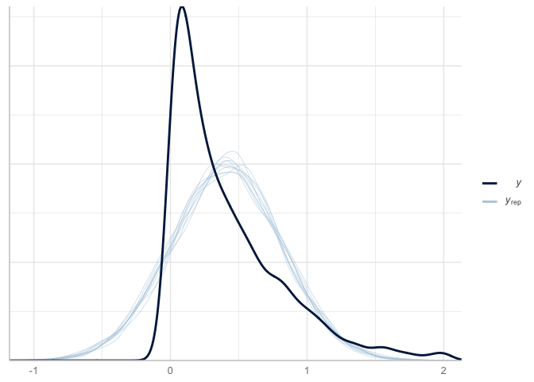
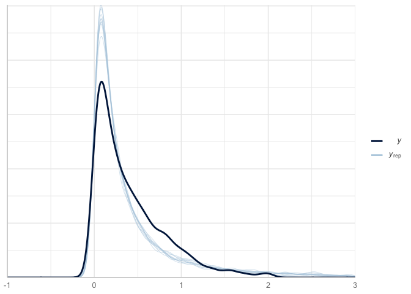

Study 1: Mixed Effects Modeling
================

## 1. Import Packages

``` r
library(ggplot2)
library(statsr)
library(lme4)
library(sjPlot)
library(dplyr)
library(brmstools)
library(modelr)
library(dplyr)
library(magrittr)
theme_set(theme_sjplot())
```

## 2. Load Data

``` r
df <- readr::read_csv("../data/vis2022/belief_data_prolific_all_exclude.csv")

# refactor and categorize
df$vis_condition <- factor(df$vis_condition, c("uncertainty","scatter","hop"))
levels(df$vis_condition ) <- c("scatter","uncertainty","hop")
```

``` r
nrow(df)
```

    ## [1] 2913

``` r
# number of  missing
sum(is.na(df$abs_belief_difference))
```

    ## [1] 0

## 3. Frequentist Mixed Effects Modeling (`lme4`)

``` r
# Absolute Belief Distance
# first model is normal response
m1 = lmer(abs_belief_difference ~ vis_condition +  (1|user_token), df)
```

``` r
a <- plot_model(m1,show.values = TRUE, vline.color = "grey", value.offset = .4, value.size = 3, type="est", show.intercept = TRUE ) +
  scale_y_continuous(breaks=seq(-.75,0.75,.25)) +
  theme(axis.text.y = element_text(size = 8),
        plot.subtitle=element_text(size=11), plot.title = element_text(size = 1)) +
  labs(subtitle = "Absolute Belief Difference", title = "") +
  ylim(-0.25, 0.9)

a
```

<!-- -->

## 4. Absolute Belief Difference

### Bayesian Mixed Effects

Let’s examine the first regression to estimate the effect on the
absolute belief change (`abs_belief_difference`). We’ll use the same
functional form as model `m`.

``` r
library(brms)

# assume normal response variable
bm <- brms::brm(abs_belief_difference ~ vis_condition + (1|user_token), data = df, backend = "cmdstanr", cores = parallel::detectCores() - 1)

save(bm, file = "../models/2022/fit_baseline_abs_belief.rda")
```

``` r
load("../models/2022/fit_baseline_abs_belief.rda")
```

First let’s look at metadata around the model.

``` r
coef_bm <- coefplot(bm)
coef_bm
```

<!-- -->

``` r
coef_m_df <- a$data %>% rename(Parameter = term) %>% mutate(Parameter = as.character(Parameter))

coef_bm_df <- coef_bm$data
coef_bm_df$Parameter[coef_bm_df$Parameter=="Intercept"] <- "(Intercept)"

joined_models <- inner_join(coef_bm_df, coef_m_df, by = "Parameter")
```

Notice that the coefficients are very similar to Frequentist:

``` r
joined_models %>%
  rename(Bayesian_Estimate = Estimate, Freq_Estimate = estimate) %>%
  select(Parameter, Bayesian_Estimate, Freq_Estimate) %>%
  mutate(abs_diff = round(abs(Bayesian_Estimate - Freq_Estimate),3)) %>%
  knitr::kable()
```

| Parameter                 | Bayesian\_Estimate | Freq\_Estimate | abs\_diff |
|:--------------------------|-------------------:|---------------:|----------:|
| (Intercept)               |          0.4245373 |      0.4249126 |     0.000 |
| vis\_conditionhop         |         -0.0248699 |     -0.0248383 |     0.000 |
| vis\_conditionuncertainty |         -0.0254608 |     -0.0260293 |     0.001 |

We see the same for the coefficients standard errors (though they mean
slightly different things):

``` r
joined_models %>%
  rename(Bayesian_Error = Est.Error, Freq_Error = std.error) %>%
  select(Parameter, Bayesian_Error, Freq_Error) %>%
  mutate(abs_diff_error = round(abs(Bayesian_Error - Freq_Error),3)) %>%
  knitr::kable()
```

| Parameter                 | Bayesian\_Error | Freq\_Error | abs\_diff\_error |
|:--------------------------|----------------:|------------:|-----------------:|
| (Intercept)               |       0.0198700 |   0.0195949 |            0.000 |
| vis\_conditionhop         |       0.0286119 |   0.0277424 |            0.001 |
| vis\_conditionuncertainty |       0.0285199 |   0.0280821 |            0.000 |

### Model convergence / posterior predictive check

The convergence stats also look good - Rhat’s are at 1 and we have
“fuzzy caterpillars”.

``` r
plot(bm)
```

<!-- -->

But remember - convergence doesn’t mean great fit. Let’s evaluate
overfitting with Posterior Predictive Checks. We’ll do 10 draws and
compare to actual.

``` r
pp_check(bm)
```

<!-- -->

### Modify response (likelihood) to lognormal

Let’s try instead a lognormal likelihood (specifically the
`hurdle_lognormal` because we have a handful of cases where
diffBeliefAbs equals zero (see [brms
comment](https://discourse.mc-stan.org/t/convergence-fails-for-every-truncated-gaussian-model/10040/2))).

``` r
bm2 <- brms::brm(abs_belief_difference ~ vis_condition + (1|user_token), data = df, family = hurdle_lognormal(link = "identity", link_sigma = "log"), backend = "cmdstanr", cores = parallel::detectCores() - 1)

save(bm2, file = "../models/2022/fit_baseline_abs_belief2.rda")
```

``` r
load("../models/2022/fit_baseline_abs_belief2.rda")
```

### What are model priors?

``` r
bm2$prior
```

    ##                    prior     class                     coef      group resp
    ##                   (flat)         b                                         
    ##                   (flat)         b         vis_conditionhop                
    ##                   (flat)         b vis_conditionuncertainty                
    ##               beta(1, 1)        hu                                         
    ##  student_t(3, -1.3, 2.5) Intercept                                         
    ##     student_t(3, 0, 2.5)        sd                                         
    ##     student_t(3, 0, 2.5)        sd                          user_token     
    ##     student_t(3, 0, 2.5)        sd                Intercept user_token     
    ##     student_t(3, 0, 2.5)     sigma                                         
    ##  dpar nlpar bound       source
    ##                        default
    ##                   (vectorized)
    ##                   (vectorized)
    ##                        default
    ##                        default
    ##                        default
    ##                   (vectorized)
    ##                   (vectorized)
    ##                        default

### What are the coefficients?

``` r
coef_bm2 <- coefplot(bm2)
coef_bm2
```

<!-- -->

### Model Comparison

First, let’s use leave-one-out (loo) cross-validation. It will also
provide estimate to determine point leverage (aka outliers).

``` r
looNormal <- loo(bm, save_psis = TRUE)
print(looNormal)
```

    ## 
    ## Computed from 4000 by 2913 log-likelihood matrix
    ## 
    ##          Estimate    SE
    ## elpd_loo  -1335.6  50.9
    ## p_loo       164.5   5.7
    ## looic      2671.3 101.8
    ## ------
    ## Monte Carlo SE of elpd_loo is 0.2.
    ## 
    ## All Pareto k estimates are good (k < 0.5).
    ## See help('pareto-k-diagnostic') for details.

``` r
looLog <- loo(bm2, save_psis = TRUE)
print(looLog)
```

    ## 
    ## Computed from 4000 by 2913 log-likelihood matrix
    ## 
    ##          Estimate    SE
    ## elpd_loo   -712.7  66.2
    ## p_loo       150.6   5.7
    ## looic      1425.4 132.5
    ## ------
    ## Monte Carlo SE of elpd_loo is 0.2.
    ## 
    ## All Pareto k estimates are good (k < 0.5).
    ## See help('pareto-k-diagnostic') for details.

When comparing two fitted models, we can estimate the difference in
their expected predictive accuracy by the difference in elpd-dloo or
elpd-dwaic.

``` r
loo_compare(looNormal, looLog)
```

    ##     elpd_diff se_diff
    ## bm2    0.0       0.0 
    ## bm  -622.9      59.9

WAIC criterion

``` r
waicNormal = waic(bm)
waicLog = waic(bm2)
loo_compare(waicNormal, waicLog)
```

    ##     elpd_diff se_diff
    ## bm2    0.0       0.0 
    ## bm  -622.7      59.9

As a last step, let’s do a posterior predictive check:

``` r
pp_check(bm2) + xlim(-1,3)
```

<!-- -->

### Compare Coefficients

As a final check, let’s compare the coefficients for the normal Bayesian
mixed effects model and the (hurdle) Lognormal Bayesian mixed effects
model.

``` r
coef_bm_df <- coef_bm$data
coef_bm2_df <- coef_bm2$data
coef_bm_df$Parameter[coef_bm_df$Parameter=="Intercept"] <- "(Intercept)"
coef_bm2_df$Parameter[coef_bm2_df$Parameter=="Intercept"] <- "(Intercept)"

joined_models <- inner_join(coef_bm_df, coef_bm2_df, by = "Parameter")
```

Let’s examine the coefficient differences with the different
likelihoods.

``` r
un_coef <- joined_models %>%
  rename(Normal_Estimate = Estimate.x, Lognormal_Estimate = Estimate.y) %>%
  select(Parameter, Normal_Estimate, Lognormal_Estimate) 

un_error <- joined_models %>%
  rename(Normal_low = `2.5%ile.x`, Normal_high = `97.5%ile.x`,Lognormal_low = `2.5%ile.y`, Lognormal_high = `97.5%ile.y`) %>%
  select(Parameter, Normal_low, Normal_high, Lognormal_low, Lognormal_high) 

var_order <- c("(Intercept)","vis_conditionuncertainty","vis_conditionhop")

inner_join(un_coef,un_error,by="Parameter") %>%
  tidyr::pivot_longer(-Parameter) %>%
  tidyr::separate(name, c("Model","Estimate"), sep = "_") %>%
  tidyr::pivot_wider(names_from = c("Estimate")) %>%
  mutate(Parameter = factor(Parameter, levels = rev(var_order))) %>%
  mutate(Model = factor(Model, levels = c("Normal", "Lognormal"))) %>%
  ggplot(aes(x = Parameter, color = Model)) +
  geom_hline(yintercept = 0, alpha = 0.4) +
  geom_point(aes(y = Estimate),  position=position_dodge(.9)) +
  geom_errorbar(aes(ymin = low, ymax = high),  position=position_dodge(.9)) +
  theme(legend.position = c(0.2,0.2),) +
  labs(title = "Abs Belief Difference", subtitle = "Vary by Response Distribution") +
  scale_color_manual(values = c("Lognormal" = "red",
                                "Normal"="black")) +  
  coord_flip()
```

<!-- -->

We see the same for the coefficients standard errors:

``` r
joined_models %>%
  rename(Normal_Error = Est.Error.x, Lognormal_Error = Est.Error.y) %>%
  select(Parameter, Normal_Error, Lognormal_Error) %>%
  mutate(Diff_Error = round(Normal_Error - Lognormal_Error,3)) %>%
  knitr::kable()
```

| Parameter                 | Normal\_Error | Lognormal\_Error | Diff\_Error |
|:--------------------------|--------------:|-----------------:|------------:|
| (Intercept)               |     0.0198700 |        0.0651396 |      -0.045 |
| vis\_conditionhop         |     0.0286119 |        0.0931659 |      -0.065 |
| vis\_conditionuncertainty |     0.0285199 |        0.0932265 |      -0.065 |

## Candidate models

For model selection, we will consider additional models.

-   `abs_belief_difference ~ vis_condition + (1|user_token) + true_correlation * vis_condition`

``` r
# https://discourse.mc-stan.org/t/smooth-spline-modeling-with-brm/6364
bm3 <- brms::brm(abs_belief_difference ~ vis_condition + (1|user_token) + true_correlation * vis_condition, data = df, family = hurdle_lognormal(link = "identity", link_sigma = "log"), backend = "cmdstanr", cores = parallel::detectCores() - 1)

save(bm3, file = "../models/2022/fit_baseline_abs_belief3.rda")
```

-   `abs_belief_difference ~ vis_condition + (1|user_token) + pre_belief_distance * vis_condition`

``` r
bm4 <- brms::brm(abs_belief_difference ~ vis_condition + (1|user_token) + pre_belief_distance * vis_condition, data = df, family = hurdle_lognormal(link = "identity", link_sigma = "log"), backend = "cmdstanr", cores = parallel::detectCores() - 1)

save(bm4, file = "../models/2022/fit_baseline_abs_belief4.rda")
```

-   `abs_belief_difference ~ vis_condition + (1|user_token) + pre_belief_distance * vis_condition + true_correlation * vis_condition`

``` r
bm5 <- brms::brm(abs_belief_difference ~ vis_condition + (1|user_token) + pre_belief_distance * vis_condition + true_correlation * vis_condition, data = df, family = hurdle_lognormal(link = "identity", link_sigma = "log"), backend = "cmdstanr", cores = parallel::detectCores() - 1)

save(bm5, file = "../models/2022/fit_baseline_abs_belief5.rda")
```

``` r
load("../models/2022/fit_baseline_abs_belief3.rda")
load("../models/2022/fit_baseline_abs_belief4.rda")
load("../models/2022/fit_baseline_abs_belief5.rda")
```

``` r
waic3 = waic(bm3)
waic4 = waic(bm4)
waic5 = waic(bm5)
```

``` r
loo_compare(waicNormal, waicLog, waic3, waic4, waic5)
```

    ##     elpd_diff se_diff
    ## bm5    0.0       0.0 
    ## bm4   -2.3       3.7 
    ## bm2   -3.5       4.9 
    ## bm3   -4.5       4.6 
    ## bm  -626.2      60.2

``` r
pp_check(bm5) + xlim(-1,3)
```

<!-- -->

``` r
coef_bm5 <- coefplot(bm5)
coef_bm5
```

<!-- -->

## Posterior Predictives

``` r
library(bayesplot)

# bm2

mcmc_areas(
  bm2,
  pars = c("b_vis_conditionuncertainty","b_vis_conditionhop"),
  prob = 0.8, # 80% intervals
  prob_outer = 0.99, # 99%
  point_est = "mean"
)
```

<!-- -->

``` r
# bm5

mcmc_areas(
  bm5,
  pars = c("b_vis_conditionuncertainty","b_vis_conditionhop"),
  prob = 0.8, # 80% intervals
  prob_outer = 0.99, # 99%
  point_est = "mean"
)
```

<!-- -->
