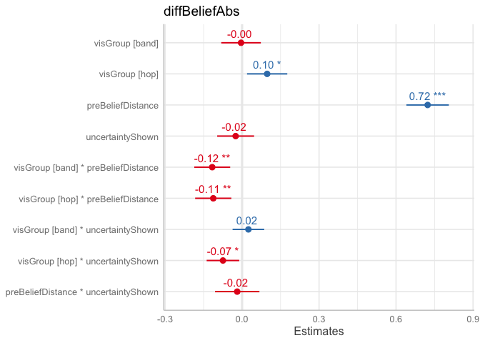
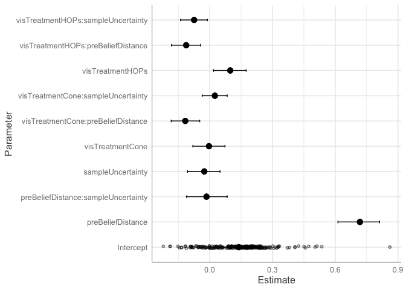
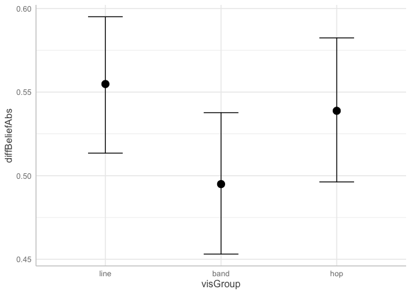
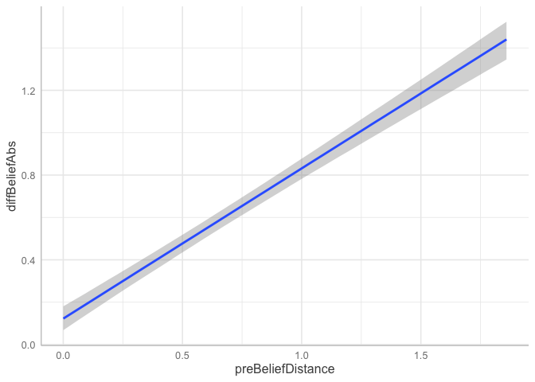
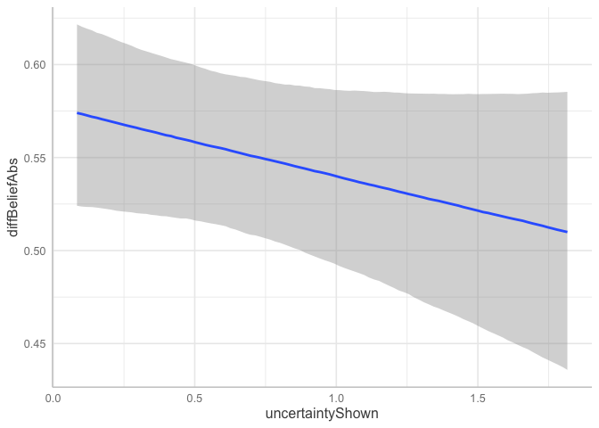
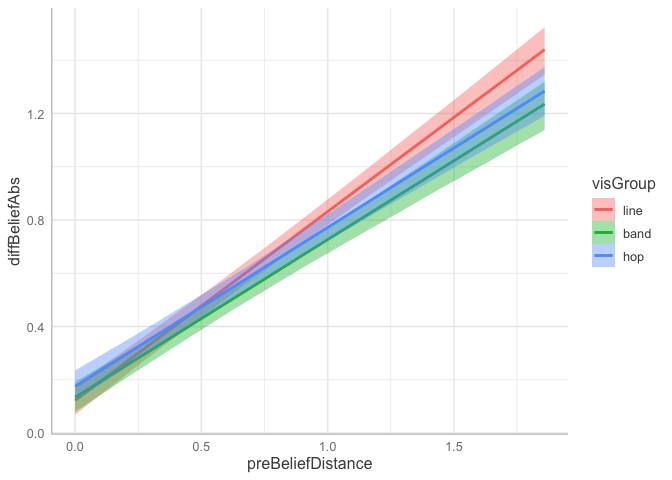
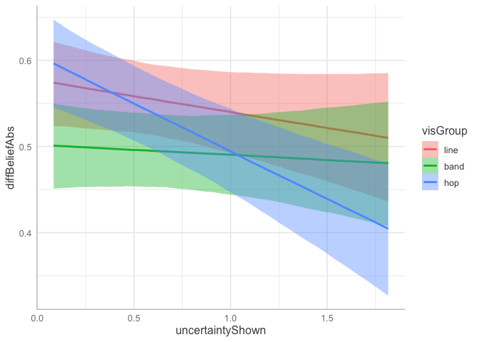
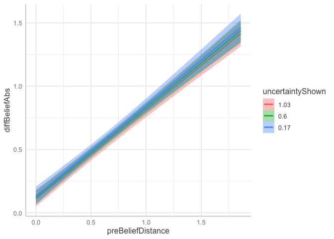

Study 3: Mixed Effects Modeling
================

## 1. Import Packages

``` r
library(ggplot2)
library(statsr)
library(lme4)
library(sjPlot)
theme_set(theme_sjplot())
```

## 2. Load Data

``` r
df <- read.csv(file="../data/vis2020/data_exclude_mturk2020-04-26.csv")

# refactor and categorize
df$visGroup <- factor(df$visGroup, c("line","band","hop"))
df$nDataShown <- factor(df$nDataShown)
```

## 3. Exploratory Graphs

``` r
ggplot(df,aes(x=uncertaintyShown,fill=nDataShown)) + 
  geom_density(alpha=0.5)
```

<!-- -->

``` r
ggplot(df,aes(x=preBeliefDistance,fill=congruency)) + 
  geom_density(alpha=0.5)
```

<!-- -->

## 4. Mixed Effects Modeling (`lme4`)

``` r
# Absolute Belief Distance
m = lmer(diffBeliefAbs ~ visGroup * preBeliefDistance + visGroup * uncertaintyShown +  uncertaintyShown * preBeliefDistance  +  (1|usertoken) + (1|vars),df)
# Uncertainty Difference
m1 = lmer(diffUncertainty ~ visGroup * preBeliefDistance + visGroup * uncertaintyShown +  uncertaintyShown * preBeliefDistance  + (1|usertoken) + (1|vars),df)
# Post Belief Distance 
m3 = lmer(postBeliefDistance ~ visGroup * preBeliefDistance + visGroup * uncertaintyShown +  uncertaintyShown * preBeliefDistance  +  (1|usertoken) + (1|vars),df)
```

``` r
plot_model(m,show.values = TRUE, value.offset = .3,type="est" ) + ylim(-0.25,0.85)
```

<!-- -->

``` r
plot_model(m1, vline.color = "red", show.values = TRUE, value.offset = .3 ) + ylim(-.3,.3)
```

<!-- -->

``` r
plot_model(m3, vline.color = "red", show.values = TRUE, value.offset = .3 ) + ylim(-.2,.2)
```

<!-- -->

## 5. Bayesian Mixed Effects

For the Vis 2020 paper, we did not run a Bayesian mixed effects model.

Let’s examine the first regression to estimate the effect on the
absolute belief change (`diffBeliefAbs`). We’ll use the same functional
form as model `m`.

``` r
library(brms)

bm <- brms::brm(diffBeliefAbs ~ visGroup * preBeliefDistance + visGroup * uncertaintyShown +  uncertaintyShown * preBeliefDistance + (1|usertoken) + (1|vars), data = df)
```

    ## 
    ## SAMPLING FOR MODEL '74d1063d2eecb58e969b7ab83e7fcd65' NOW (CHAIN 1).
    ## Chain 1: 
    ## Chain 1: Gradient evaluation took 0.000216 seconds
    ## Chain 1: 1000 transitions using 10 leapfrog steps per transition would take 2.16 seconds.
    ## Chain 1: Adjust your expectations accordingly!
    ## Chain 1: 
    ## Chain 1: 
    ## Chain 1: Iteration:    1 / 2000 [  0%]  (Warmup)
    ## Chain 1: Iteration:  200 / 2000 [ 10%]  (Warmup)
    ## Chain 1: Iteration:  400 / 2000 [ 20%]  (Warmup)
    ## Chain 1: Iteration:  600 / 2000 [ 30%]  (Warmup)
    ## Chain 1: Iteration:  800 / 2000 [ 40%]  (Warmup)
    ## Chain 1: Iteration: 1000 / 2000 [ 50%]  (Warmup)
    ## Chain 1: Iteration: 1001 / 2000 [ 50%]  (Sampling)
    ## Chain 1: Iteration: 1200 / 2000 [ 60%]  (Sampling)
    ## Chain 1: Iteration: 1400 / 2000 [ 70%]  (Sampling)
    ## Chain 1: Iteration: 1600 / 2000 [ 80%]  (Sampling)
    ## Chain 1: Iteration: 1800 / 2000 [ 90%]  (Sampling)
    ## Chain 1: Iteration: 2000 / 2000 [100%]  (Sampling)
    ## Chain 1: 
    ## Chain 1:  Elapsed Time: 9.39054 seconds (Warm-up)
    ## Chain 1:                4.83726 seconds (Sampling)
    ## Chain 1:                14.2278 seconds (Total)
    ## Chain 1: 
    ## 
    ## SAMPLING FOR MODEL '74d1063d2eecb58e969b7ab83e7fcd65' NOW (CHAIN 2).
    ## Chain 2: 
    ## Chain 2: Gradient evaluation took 0.000157 seconds
    ## Chain 2: 1000 transitions using 10 leapfrog steps per transition would take 1.57 seconds.
    ## Chain 2: Adjust your expectations accordingly!
    ## Chain 2: 
    ## Chain 2: 
    ## Chain 2: Iteration:    1 / 2000 [  0%]  (Warmup)
    ## Chain 2: Iteration:  200 / 2000 [ 10%]  (Warmup)
    ## Chain 2: Iteration:  400 / 2000 [ 20%]  (Warmup)
    ## Chain 2: Iteration:  600 / 2000 [ 30%]  (Warmup)
    ## Chain 2: Iteration:  800 / 2000 [ 40%]  (Warmup)
    ## Chain 2: Iteration: 1000 / 2000 [ 50%]  (Warmup)
    ## Chain 2: Iteration: 1001 / 2000 [ 50%]  (Sampling)
    ## Chain 2: Iteration: 1200 / 2000 [ 60%]  (Sampling)
    ## Chain 2: Iteration: 1400 / 2000 [ 70%]  (Sampling)
    ## Chain 2: Iteration: 1600 / 2000 [ 80%]  (Sampling)
    ## Chain 2: Iteration: 1800 / 2000 [ 90%]  (Sampling)
    ## Chain 2: Iteration: 2000 / 2000 [100%]  (Sampling)
    ## Chain 2: 
    ## Chain 2:  Elapsed Time: 10.2163 seconds (Warm-up)
    ## Chain 2:                4.85112 seconds (Sampling)
    ## Chain 2:                15.0674 seconds (Total)
    ## Chain 2: 
    ## 
    ## SAMPLING FOR MODEL '74d1063d2eecb58e969b7ab83e7fcd65' NOW (CHAIN 3).
    ## Chain 3: 
    ## Chain 3: Gradient evaluation took 0.000162 seconds
    ## Chain 3: 1000 transitions using 10 leapfrog steps per transition would take 1.62 seconds.
    ## Chain 3: Adjust your expectations accordingly!
    ## Chain 3: 
    ## Chain 3: 
    ## Chain 3: Iteration:    1 / 2000 [  0%]  (Warmup)
    ## Chain 3: Iteration:  200 / 2000 [ 10%]  (Warmup)
    ## Chain 3: Iteration:  400 / 2000 [ 20%]  (Warmup)
    ## Chain 3: Iteration:  600 / 2000 [ 30%]  (Warmup)
    ## Chain 3: Iteration:  800 / 2000 [ 40%]  (Warmup)
    ## Chain 3: Iteration: 1000 / 2000 [ 50%]  (Warmup)
    ## Chain 3: Iteration: 1001 / 2000 [ 50%]  (Sampling)
    ## Chain 3: Iteration: 1200 / 2000 [ 60%]  (Sampling)
    ## Chain 3: Iteration: 1400 / 2000 [ 70%]  (Sampling)
    ## Chain 3: Iteration: 1600 / 2000 [ 80%]  (Sampling)
    ## Chain 3: Iteration: 1800 / 2000 [ 90%]  (Sampling)
    ## Chain 3: Iteration: 2000 / 2000 [100%]  (Sampling)
    ## Chain 3: 
    ## Chain 3:  Elapsed Time: 9.96601 seconds (Warm-up)
    ## Chain 3:                4.98748 seconds (Sampling)
    ## Chain 3:                14.9535 seconds (Total)
    ## Chain 3: 
    ## 
    ## SAMPLING FOR MODEL '74d1063d2eecb58e969b7ab83e7fcd65' NOW (CHAIN 4).
    ## Chain 4: 
    ## Chain 4: Gradient evaluation took 0.000157 seconds
    ## Chain 4: 1000 transitions using 10 leapfrog steps per transition would take 1.57 seconds.
    ## Chain 4: Adjust your expectations accordingly!
    ## Chain 4: 
    ## Chain 4: 
    ## Chain 4: Iteration:    1 / 2000 [  0%]  (Warmup)
    ## Chain 4: Iteration:  200 / 2000 [ 10%]  (Warmup)
    ## Chain 4: Iteration:  400 / 2000 [ 20%]  (Warmup)
    ## Chain 4: Iteration:  600 / 2000 [ 30%]  (Warmup)
    ## Chain 4: Iteration:  800 / 2000 [ 40%]  (Warmup)
    ## Chain 4: Iteration: 1000 / 2000 [ 50%]  (Warmup)
    ## Chain 4: Iteration: 1001 / 2000 [ 50%]  (Sampling)
    ## Chain 4: Iteration: 1200 / 2000 [ 60%]  (Sampling)
    ## Chain 4: Iteration: 1400 / 2000 [ 70%]  (Sampling)
    ## Chain 4: Iteration: 1600 / 2000 [ 80%]  (Sampling)
    ## Chain 4: Iteration: 1800 / 2000 [ 90%]  (Sampling)
    ## Chain 4: Iteration: 2000 / 2000 [100%]  (Sampling)
    ## Chain 4: 
    ## Chain 4:  Elapsed Time: 9.58953 seconds (Warm-up)
    ## Chain 4:                4.99442 seconds (Sampling)
    ## Chain 4:                14.5839 seconds (Total)
    ## Chain 4:

First let’s look at metadata around the model.

``` r
bm
```

    ##  Family: gaussian 
    ##   Links: mu = identity; sigma = identity 
    ## Formula: diffBeliefAbs ~ visGroup * preBeliefDistance + visGroup * uncertaintyShown + uncertaintyShown * preBeliefDistance + (1 | usertoken) + (1 | vars) 
    ##    Data: df (Number of observations: 4228) 
    ##   Draws: 4 chains, each with iter = 2000; warmup = 1000; thin = 1;
    ##          total post-warmup draws = 4000
    ## 
    ## Group-Level Effects: 
    ## ~usertoken (Number of levels: 265) 
    ##               Estimate Est.Error l-95% CI u-95% CI Rhat Bulk_ESS Tail_ESS
    ## sd(Intercept)     0.16      0.01     0.14     0.18 1.00     1669     2507
    ## 
    ## ~vars (Number of levels: 16) 
    ##               Estimate Est.Error l-95% CI u-95% CI Rhat Bulk_ESS Tail_ESS
    ## sd(Intercept)     0.04      0.01     0.02     0.07 1.00     1216     1966
    ## 
    ## Population-Level Effects: 
    ##                                    Estimate Est.Error l-95% CI u-95% CI Rhat
    ## Intercept                              0.14      0.04     0.06     0.22 1.00
    ## visGroupband                          -0.00      0.04    -0.08     0.07 1.00
    ## visGrouphop                            0.10      0.04     0.02     0.17 1.00
    ## preBeliefDistance                      0.72      0.05     0.62     0.81 1.00
    ## uncertaintyShown                      -0.03      0.04    -0.11     0.05 1.00
    ## visGroupband:preBeliefDistance        -0.12      0.04    -0.19    -0.04 1.00
    ## visGrouphop:preBeliefDistance         -0.11      0.04    -0.18    -0.04 1.00
    ## visGroupband:uncertaintyShown          0.02      0.03    -0.04     0.09 1.00
    ## visGrouphop:uncertaintyShown          -0.07      0.03    -0.14    -0.01 1.00
    ## preBeliefDistance:uncertaintyShown    -0.01      0.05    -0.11     0.09 1.00
    ##                                    Bulk_ESS Tail_ESS
    ## Intercept                              1979     2893
    ## visGroupband                           2753     3137
    ## visGrouphop                            2721     3044
    ## preBeliefDistance                      2053     2477
    ## uncertaintyShown                       2863     2745
    ## visGroupband:preBeliefDistance         5943     2931
    ## visGrouphop:preBeliefDistance          5297     3077
    ## visGroupband:uncertaintyShown          5372     3268
    ## visGrouphop:uncertaintyShown           6001     3180
    ## preBeliefDistance:uncertaintyShown     2490     3093
    ## 
    ## Family Specific Parameters: 
    ##       Estimate Est.Error l-95% CI u-95% CI Rhat Bulk_ESS Tail_ESS
    ## sigma     0.36      0.00     0.35     0.37 1.00     8644     2961
    ## 
    ## Draws were sampled using sampling(NUTS). For each parameter, Bulk_ESS
    ## and Tail_ESS are effective sample size measures, and Rhat is the potential
    ## scale reduction factor on split chains (at convergence, Rhat = 1).

Notice that the coefficients are very similar to Frequentist:

``` r
m
```

    ## Linear mixed model fit by REML ['lmerMod']
    ## Formula: 
    ## diffBeliefAbs ~ visGroup * preBeliefDistance + visGroup * uncertaintyShown +  
    ##     uncertaintyShown * preBeliefDistance + (1 | usertoken) +      (1 | vars)
    ##    Data: df
    ## REML criterion at convergence: 3844.758
    ## Random effects:
    ##  Groups    Name        Std.Dev.
    ##  usertoken (Intercept) 0.15714 
    ##  vars      (Intercept) 0.03268 
    ##  Residual              0.36238 
    ## Number of obs: 4228, groups:  usertoken, 265; vars, 16
    ## Fixed Effects:
    ##                        (Intercept)                        visGroupband  
    ##                           0.135840                           -0.003965  
    ##                        visGrouphop                   preBeliefDistance  
    ##                           0.097762                            0.723143  
    ##                   uncertaintyShown      visGroupband:preBeliefDistance  
    ##                          -0.024993                           -0.116221  
    ##      visGrouphop:preBeliefDistance       visGroupband:uncertaintyShown  
    ##                          -0.112259                            0.024742  
    ##       visGrouphop:uncertaintyShown  preBeliefDistance:uncertaintyShown  
    ##                          -0.074495                           -0.018877

The convergence stats also look good - Rhat’s are at 1 and we have
“fuzzy catepillars”.

``` r
plot(bm)
```

<!-- --><!-- --><!-- -->

But remember - convergence doesn’t mean great fit. Let’s evaluate
overfitting with Posterior Predictive Checks. We’ll do 10 draws and
compare to actual.

``` r
pp_check(bm)
```

<!-- -->

There looks like some misspecification.

Let’s try instead a lognormal likelihood.

``` r
df$diffBeliefAbsAdjusted <- ifelse(df$diffBeliefAbs==0,0.01,df$diffBeliefAbs)

bm2 <- brms::brm(diffBeliefAbsAdjusted ~ visGroup * preBeliefDistance + visGroup * uncertaintyShown +  uncertaintyShown * preBeliefDistance + (1|usertoken) + (1|vars), data = df, family = lognormal(link = "identity", link_sigma = "log"))
```

    ## 
    ## SAMPLING FOR MODEL '11a53c6ad19ac062301c378ce705418c' NOW (CHAIN 1).
    ## Chain 1: 
    ## Chain 1: Gradient evaluation took 0.000407 seconds
    ## Chain 1: 1000 transitions using 10 leapfrog steps per transition would take 4.07 seconds.
    ## Chain 1: Adjust your expectations accordingly!
    ## Chain 1: 
    ## Chain 1: 
    ## Chain 1: Iteration:    1 / 2000 [  0%]  (Warmup)
    ## Chain 1: Iteration:  200 / 2000 [ 10%]  (Warmup)
    ## Chain 1: Iteration:  400 / 2000 [ 20%]  (Warmup)
    ## Chain 1: Iteration:  600 / 2000 [ 30%]  (Warmup)
    ## Chain 1: Iteration:  800 / 2000 [ 40%]  (Warmup)
    ## Chain 1: Iteration: 1000 / 2000 [ 50%]  (Warmup)
    ## Chain 1: Iteration: 1001 / 2000 [ 50%]  (Sampling)
    ## Chain 1: Iteration: 1200 / 2000 [ 60%]  (Sampling)
    ## Chain 1: Iteration: 1400 / 2000 [ 70%]  (Sampling)
    ## Chain 1: Iteration: 1600 / 2000 [ 80%]  (Sampling)
    ## Chain 1: Iteration: 1800 / 2000 [ 90%]  (Sampling)
    ## Chain 1: Iteration: 2000 / 2000 [100%]  (Sampling)
    ## Chain 1: 
    ## Chain 1:  Elapsed Time: 13.4402 seconds (Warm-up)
    ## Chain 1:                8.835 seconds (Sampling)
    ## Chain 1:                22.2752 seconds (Total)
    ## Chain 1: 
    ## 
    ## SAMPLING FOR MODEL '11a53c6ad19ac062301c378ce705418c' NOW (CHAIN 2).
    ## Chain 2: 
    ## Chain 2: Gradient evaluation took 0.00028 seconds
    ## Chain 2: 1000 transitions using 10 leapfrog steps per transition would take 2.8 seconds.
    ## Chain 2: Adjust your expectations accordingly!
    ## Chain 2: 
    ## Chain 2: 
    ## Chain 2: Iteration:    1 / 2000 [  0%]  (Warmup)
    ## Chain 2: Iteration:  200 / 2000 [ 10%]  (Warmup)
    ## Chain 2: Iteration:  400 / 2000 [ 20%]  (Warmup)
    ## Chain 2: Iteration:  600 / 2000 [ 30%]  (Warmup)
    ## Chain 2: Iteration:  800 / 2000 [ 40%]  (Warmup)
    ## Chain 2: Iteration: 1000 / 2000 [ 50%]  (Warmup)
    ## Chain 2: Iteration: 1001 / 2000 [ 50%]  (Sampling)
    ## Chain 2: Iteration: 1200 / 2000 [ 60%]  (Sampling)
    ## Chain 2: Iteration: 1400 / 2000 [ 70%]  (Sampling)
    ## Chain 2: Iteration: 1600 / 2000 [ 80%]  (Sampling)
    ## Chain 2: Iteration: 1800 / 2000 [ 90%]  (Sampling)
    ## Chain 2: Iteration: 2000 / 2000 [100%]  (Sampling)
    ## Chain 2: 
    ## Chain 2:  Elapsed Time: 13.0335 seconds (Warm-up)
    ## Chain 2:                8.86075 seconds (Sampling)
    ## Chain 2:                21.8942 seconds (Total)
    ## Chain 2: 
    ## 
    ## SAMPLING FOR MODEL '11a53c6ad19ac062301c378ce705418c' NOW (CHAIN 3).
    ## Chain 3: 
    ## Chain 3: Gradient evaluation took 0.000284 seconds
    ## Chain 3: 1000 transitions using 10 leapfrog steps per transition would take 2.84 seconds.
    ## Chain 3: Adjust your expectations accordingly!
    ## Chain 3: 
    ## Chain 3: 
    ## Chain 3: Iteration:    1 / 2000 [  0%]  (Warmup)
    ## Chain 3: Iteration:  200 / 2000 [ 10%]  (Warmup)
    ## Chain 3: Iteration:  400 / 2000 [ 20%]  (Warmup)
    ## Chain 3: Iteration:  600 / 2000 [ 30%]  (Warmup)
    ## Chain 3: Iteration:  800 / 2000 [ 40%]  (Warmup)
    ## Chain 3: Iteration: 1000 / 2000 [ 50%]  (Warmup)
    ## Chain 3: Iteration: 1001 / 2000 [ 50%]  (Sampling)
    ## Chain 3: Iteration: 1200 / 2000 [ 60%]  (Sampling)
    ## Chain 3: Iteration: 1400 / 2000 [ 70%]  (Sampling)
    ## Chain 3: Iteration: 1600 / 2000 [ 80%]  (Sampling)
    ## Chain 3: Iteration: 1800 / 2000 [ 90%]  (Sampling)
    ## Chain 3: Iteration: 2000 / 2000 [100%]  (Sampling)
    ## Chain 3: 
    ## Chain 3:  Elapsed Time: 12.9791 seconds (Warm-up)
    ## Chain 3:                8.89216 seconds (Sampling)
    ## Chain 3:                21.8713 seconds (Total)
    ## Chain 3: 
    ## 
    ## SAMPLING FOR MODEL '11a53c6ad19ac062301c378ce705418c' NOW (CHAIN 4).
    ## Chain 4: 
    ## Chain 4: Gradient evaluation took 0.000282 seconds
    ## Chain 4: 1000 transitions using 10 leapfrog steps per transition would take 2.82 seconds.
    ## Chain 4: Adjust your expectations accordingly!
    ## Chain 4: 
    ## Chain 4: 
    ## Chain 4: Iteration:    1 / 2000 [  0%]  (Warmup)
    ## Chain 4: Iteration:  200 / 2000 [ 10%]  (Warmup)
    ## Chain 4: Iteration:  400 / 2000 [ 20%]  (Warmup)
    ## Chain 4: Iteration:  600 / 2000 [ 30%]  (Warmup)
    ## Chain 4: Iteration:  800 / 2000 [ 40%]  (Warmup)
    ## Chain 4: Iteration: 1000 / 2000 [ 50%]  (Warmup)
    ## Chain 4: Iteration: 1001 / 2000 [ 50%]  (Sampling)
    ## Chain 4: Iteration: 1200 / 2000 [ 60%]  (Sampling)
    ## Chain 4: Iteration: 1400 / 2000 [ 70%]  (Sampling)
    ## Chain 4: Iteration: 1600 / 2000 [ 80%]  (Sampling)
    ## Chain 4: Iteration: 1800 / 2000 [ 90%]  (Sampling)
    ## Chain 4: Iteration: 2000 / 2000 [100%]  (Sampling)
    ## Chain 4: 
    ## Chain 4:  Elapsed Time: 13.0894 seconds (Warm-up)
    ## Chain 4:                7.39629 seconds (Sampling)
    ## Chain 4:                20.4857 seconds (Total)
    ## Chain 4:

``` r
bm2
```

    ##  Family: lognormal 
    ##   Links: mu = identity; sigma = identity 
    ## Formula: diffBeliefAbsAdjusted ~ visGroup * preBeliefDistance + visGroup * uncertaintyShown + uncertaintyShown * preBeliefDistance + (1 | usertoken) + (1 | vars) 
    ##    Data: df (Number of observations: 4228) 
    ##   Draws: 4 chains, each with iter = 2000; warmup = 1000; thin = 1;
    ##          total post-warmup draws = 4000
    ## 
    ## Group-Level Effects: 
    ## ~usertoken (Number of levels: 265) 
    ##               Estimate Est.Error l-95% CI u-95% CI Rhat Bulk_ESS Tail_ESS
    ## sd(Intercept)     0.46      0.03     0.41     0.52 1.00     1543     2346
    ## 
    ## ~vars (Number of levels: 16) 
    ##               Estimate Est.Error l-95% CI u-95% CI Rhat Bulk_ESS Tail_ESS
    ## sd(Intercept)     0.12      0.04     0.05     0.22 1.00     1031     1662
    ## 
    ## Population-Level Effects: 
    ##                                    Estimate Est.Error l-95% CI u-95% CI Rhat
    ## Intercept                             -2.36      0.12    -2.60    -2.12 1.00
    ## visGroupband                          -0.14      0.13    -0.39     0.10 1.00
    ## visGrouphop                            0.12      0.13    -0.13     0.37 1.00
    ## preBeliefDistance                      1.90      0.15     1.61     2.19 1.00
    ## uncertaintyShown                       0.21      0.12    -0.03     0.46 1.00
    ## visGroupband:preBeliefDistance        -0.10      0.12    -0.34     0.13 1.00
    ## visGrouphop:preBeliefDistance         -0.13      0.12    -0.37     0.11 1.00
    ## visGroupband:uncertaintyShown          0.03      0.11    -0.17     0.24 1.00
    ## visGrouphop:uncertaintyShown          -0.28      0.11    -0.50    -0.07 1.00
    ## preBeliefDistance:uncertaintyShown    -0.29      0.15    -0.58    -0.01 1.00
    ##                                    Bulk_ESS Tail_ESS
    ## Intercept                              3029     2982
    ## visGroupband                           3321     2914
    ## visGrouphop                            3157     3157
    ## preBeliefDistance                      3178     2610
    ## uncertaintyShown                       3858     2899
    ## visGroupband:preBeliefDistance         4810     2973
    ## visGrouphop:preBeliefDistance          5240     3126
    ## visGroupband:uncertaintyShown          5945     3336
    ## visGrouphop:uncertaintyShown           4719     3409
    ## preBeliefDistance:uncertaintyShown     4225     3102
    ## 
    ## Family Specific Parameters: 
    ##       Estimate Est.Error l-95% CI u-95% CI Rhat Bulk_ESS Tail_ESS
    ## sigma     1.21      0.01     1.18     1.24 1.00     6308     3153
    ## 
    ## Draws were sampled using sampling(NUTS). For each parameter, Bulk_ESS
    ## and Tail_ESS are effective sample size measures, and Rhat is the potential
    ## scale reduction factor on split chains (at convergence, Rhat = 1).

We can also view the conditional effects:

``` r
conditional_effects(bm) # conditions = data.frame(size = 1)
```

<!-- --><!-- --><!-- --><!-- --><!-- --><!-- -->

But let’s now look at the posterior predictive check.

``` r
pp_check(bm2) + xlim(-1,3)
```

<!-- -->

Better – but we’re still overfitting. It appears to be bimodal.

This may be a solution to do a Bayesian mixture for lognormal. [Chapter
20 of “An Introduction to Bayesian Data Analysis for Cognitive
Science”](https://vasishth.github.io/bayescogsci/book/a-mixture-model-of-the-speed-accuracy-trade-off-the-fast-guess-model-account.html)
