Study 3: Mixed Effects Modeling
================

## 1. Import Packages

``` r
library(ggplot2)
library(statsr)
library(lme4)
library(sjPlot)
library(dplyr)
library(brmstools)
theme_set(theme_sjplot())
```

## 2. Load Data

``` r
df <- read.csv(file="../data/vis2020/data_exclude.csv")

# refactor and categorize
df$visGroup <- factor(df$visGroup, c("line","band","hop"))
levels(df$visGroup ) <- c("Line","Cone","HOPs")
df$nDataShown <- factor(df$nDataShown)

df <- rename(df, 
             sampleUncertainty = uncertaintyShown,
             visTreatment = visGroup)

df <- within(df, visTreatment <- relevel(visTreatment, ref = 1))
```

## 3. Exploratory Graphs

``` r
g1 <- df %>%
  rename(Congruency = congruency) %>%
  ggplot(aes(x=preBeliefDistance,fill=Congruency)) + 
  geom_density(alpha=0.5) +
  annotate("text", x = 1.4, y = 2.8, label = "Incongruent", size = 2.5) +
  annotate("text", x = 0.75, y = 3.7, label = "Congruent", size = 2.5) +
  theme(legend.position = "none") + 
  labs(x = " ", y = " ", subtitle = "Pre-Belief Distance") 

g2 <- df %>%
  ggplot(aes(x=sampleUncertainty,fill=nDataShown)) + 
  geom_density(alpha=0.5) +
  annotate("text", x = 1.3, y = 2, label = "Data Shown\n(n = 10)", size = 2.5) +
  annotate("text", x = 0.75, y = 3.7, label = "Data Shown\n(n = 100)", size = 2.5) +
  theme(legend.position = "none") +
  labs(x = " ", y = " ", subtitle = "Sample Uncertainty")

cowplot::plot_grid(g1, g2,
                   label_x = -0.2,
                   ncol = 2)
```

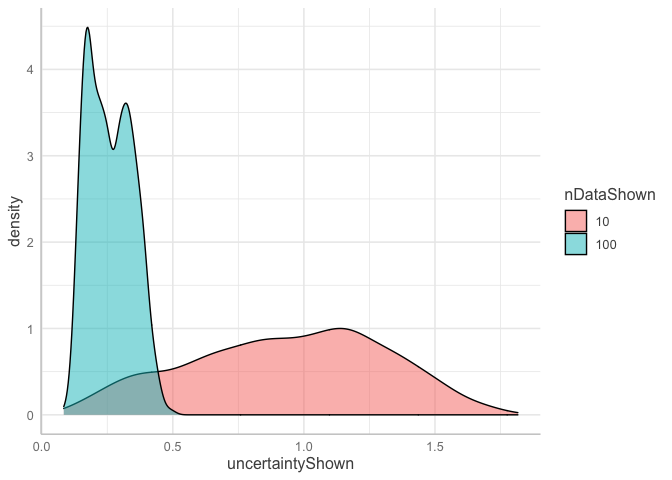<!-- -->

## 4. Frequentist Mixed Effects Modeling (`lme4`)

``` r
# Absolute Belief Distance
m = lmer(diffBeliefAbs ~ visTreatment * preBeliefDistance + visTreatment * sampleUncertainty +  sampleUncertainty * preBeliefDistance  +  (1|usertoken) + (1|vars),df)
# Uncertainty Difference
m1 = lmer(diffUncertainty ~ visTreatment * preBeliefDistance + visTreatment * sampleUncertainty +  sampleUncertainty * preBeliefDistance  + (1|usertoken) + (1|vars),df)
```

``` r
a <- plot_model(m,show.values = TRUE, vline.color = "grey", value.offset = .4, value.size = 3, type="est", show.intercept = TRUE ) +
  scale_y_continuous(breaks=seq(-.75,0.75,.25)) +
  theme(axis.text.y = element_text(size = 8),
        plot.subtitle=element_text(size=11), plot.title = element_text(size = 1)) +
  labs(subtitle = "Absolute Belief Difference", title = "") +
  ylim(-0.25, 0.9)

b <- plot_model(m1, vline.color = "grey",show.values = TRUE, value.offset = .4, value.size = 3, show.intercept = TRUE) +
  ylim(-.3,.3) +
  theme(axis.text.y=element_blank(),
        plot.subtitle=element_text(size=11), plot.title = element_text(size = 1)) +
  labs(subtitle = "Uncertainty Difference", title = "")

# final plots
library(cowplot)

plot_grid(a,
  b,
  label_x = -0.2,
  ncol = 2,
  rel_widths = c(4.6, 2.4)) 
```

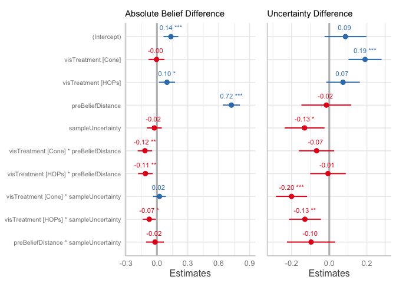<!-- -->

## 5a. Absolute Belief Difference

### Bayesian Mixed Effects

For the Vis 2020 paper, we did not run a Bayesian mixed effects model.

Let’s examine the first regression to estimate the effect on the
absolute belief change (`diffBeliefAbs`). We’ll use the same functional
form as model `m`.

``` r
library(brms)

bm <- brms::brm(diffBeliefAbs ~ visTreatment * preBeliefDistance + visTreatment * sampleUncertainty +  sampleUncertainty * preBeliefDistance + (1|usertoken) + (1|vars), data = df)

save(bm, file = "../models/fit_bm.rda")
```

``` r
load("../models/fit_bm.rda")
```

First let’s look at metadata around the model.

``` r
coef_bm <- coefplot(bm)
coef_bm
```

<!-- -->

``` r
coef_m_df <- a$data %>% rename(Parameter = term) %>% mutate(Parameter = as.character(Parameter))

coef_bm_df <- coef_bm$data
coef_bm_df$Parameter[coef_bm_df$Parameter=="Intercept"] <- "(Intercept)"

joined_models <- inner_join(coef_bm_df, coef_m_df, by = "Parameter")
```

Notice that the coefficients are very similar to Frequentist:

``` r
joined_models %>%
  rename(Bayesian_Estimate = Estimate, Freq_Estimate = estimate) %>%
  select(Parameter, Bayesian_Estimate, Freq_Estimate) %>%
  mutate(abs_diff = round(abs(Bayesian_Estimate - Freq_Estimate),3)) %>%
  knitr::kable()
```

| Parameter                           | Bayesian\_Estimate | Freq\_Estimate | abs\_diff |
|:------------------------------------|-------------------:|---------------:|----------:|
| (Intercept)                         |          0.1370895 |      0.1340957 |     0.003 |
| preBeliefDistance                   |          0.7203690 |      0.7252758 |     0.005 |
| preBeliefDistance:sampleUncertainty |         -0.0173364 |     -0.0210087 |     0.004 |
| sampleUncertainty                   |         -0.0249417 |     -0.0226014 |     0.002 |
| visTreatmentCone                    |         -0.0030583 |     -0.0034115 |     0.000 |
| visTreatmentCone:preBeliefDistance  |         -0.1175889 |     -0.1171506 |     0.000 |
| visTreatmentCone:sampleUncertainty  |          0.0242470 |      0.0244427 |     0.000 |
| visTreatmentHOPs                    |          0.0954937 |      0.0951972 |     0.000 |
| visTreatmentHOPs:preBeliefDistance  |         -0.1135297 |     -0.1128555 |     0.001 |
| visTreatmentHOPs:sampleUncertainty  |         -0.0702007 |     -0.0699720 |     0.000 |

We see the same for the coefficients standard errors (though they mean
slightly different things):

``` r
joined_models %>%
  rename(Bayesian_Error = Est.Error, Freq_Error = std.error) %>%
  select(Parameter, Bayesian_Error, Freq_Error) %>%
  mutate(abs_diff_error = round(abs(Bayesian_Error - Freq_Error),3)) %>%
  knitr::kable()
```

| Parameter                           | Bayesian\_Error | Freq\_Error | abs\_diff\_error |
|:------------------------------------|----------------:|------------:|-----------------:|
| (Intercept)                         |       0.0402823 |   0.0364427 |            0.004 |
| preBeliefDistance                   |       0.0510357 |   0.0420362 |            0.009 |
| preBeliefDistance:sampleUncertainty |       0.0504522 |   0.0439540 |            0.006 |
| sampleUncertainty                   |       0.0385527 |   0.0364888 |            0.002 |
| visTreatmentCone                    |       0.0391009 |   0.0390879 |            0.000 |
| visTreatmentCone:preBeliefDistance  |       0.0352947 |   0.0354924 |            0.000 |
| visTreatmentCone:sampleUncertainty  |       0.0309645 |   0.0313056 |            0.000 |
| visTreatmentHOPs                    |       0.0399006 |   0.0396635 |            0.000 |
| visTreatmentHOPs:preBeliefDistance  |       0.0358284 |   0.0357082 |            0.000 |
| visTreatmentHOPs:sampleUncertainty  |       0.0317713 |   0.0320763 |            0.000 |

### Model convergence / posterior predictive check

The convergence stats also look good - Rhat’s are at 1 and we have
“fuzzy caterpillars”.

``` r
plot(bm)
```

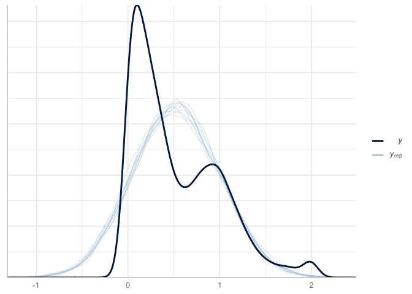<!-- -->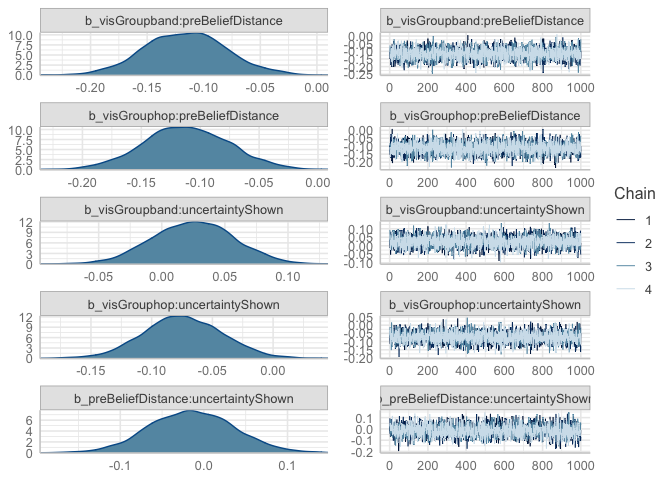<!-- -->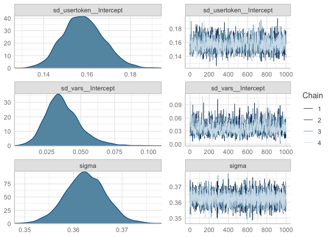<!-- -->

But remember - convergence doesn’t mean great fit. Let’s evaluate
overfitting with Posterior Predictive Checks. We’ll do 10 draws and
compare to actual.

``` r
pp_check(bm)
```

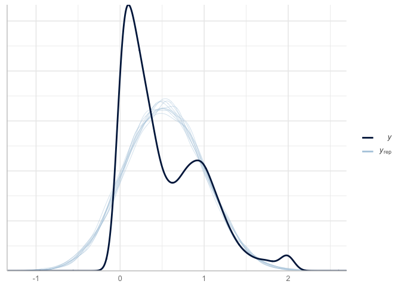<!-- -->

There looks like some misspecification.

### Modify response (likelihood) to lognormal

Let’s try instead a lognormal likelihood (specifically the
`hurdle_lognormal` because we have a handful of cases where
diffBeliefAbs equals zero (see [brms
comment](https://discourse.mc-stan.org/t/convergence-fails-for-every-truncated-gaussian-model/10040/2)))..

``` r
#df$diffBeliefAbsAdjusted <- ifelse(df$diffBeliefAbs==0,0.01,df$diffBeliefAbs)

bm2 <- brms::brm(diffBeliefAbs ~ visTreatment * preBeliefDistance + visTreatment * sampleUncertainty +  sampleUncertainty * preBeliefDistance + (1|usertoken) + (1|vars), data = df, family = hurdle_lognormal(link = "identity", link_sigma = "log"))

save(bm2, file = "../models/fit_bm2.rda")
```

``` r
load("../models/fit_bm2.rda")
```

### What are model priors?

``` r
bm2$prior
```

    ##                  prior     class                                coef     group
    ##                 (flat)         b                                              
    ##                 (flat)         b                   preBeliefDistance          
    ##                 (flat)         b preBeliefDistance:sampleUncertainty          
    ##                 (flat)         b                   sampleUncertainty          
    ##                 (flat)         b                    visTreatmentCone          
    ##                 (flat)         b  visTreatmentCone:preBeliefDistance          
    ##                 (flat)         b  visTreatmentCone:sampleUncertainty          
    ##                 (flat)         b                    visTreatmentHOPs          
    ##                 (flat)         b  visTreatmentHOPs:preBeliefDistance          
    ##                 (flat)         b  visTreatmentHOPs:sampleUncertainty          
    ##             beta(1, 1)        hu                                              
    ##  student_t(3, -1, 2.5) Intercept                                              
    ##   student_t(3, 0, 2.5)        sd                                              
    ##   student_t(3, 0, 2.5)        sd                                     usertoken
    ##   student_t(3, 0, 2.5)        sd                           Intercept usertoken
    ##   student_t(3, 0, 2.5)        sd                                          vars
    ##   student_t(3, 0, 2.5)        sd                           Intercept      vars
    ##   student_t(3, 0, 2.5)     sigma                                              
    ##  resp dpar nlpar bound       source
    ##                             default
    ##                        (vectorized)
    ##                        (vectorized)
    ##                        (vectorized)
    ##                        (vectorized)
    ##                        (vectorized)
    ##                        (vectorized)
    ##                        (vectorized)
    ##                        (vectorized)
    ##                        (vectorized)
    ##                             default
    ##                             default
    ##                             default
    ##                        (vectorized)
    ##                        (vectorized)
    ##                        (vectorized)
    ##                        (vectorized)
    ##                             default

### What are the coefficients?

``` r
coef_bm2 <- coefplot(bm2)
coef_bm2
```

<!-- -->

### Model Comparison

First, let’s use leave-one-out (loo) cross-validation. It will also
provide estimate to determine point leverage (aka outliers).

``` r
looNormal <- loo(bm, save_psis = TRUE)
print(looNormal)
```

    ## 
    ## Computed from 4000 by 4260 log-likelihood matrix
    ## 
    ##          Estimate    SE
    ## elpd_loo  -1825.9  76.4
    ## p_loo       218.3   7.7
    ## looic      3651.9 152.7
    ## ------
    ## Monte Carlo SE of elpd_loo is 0.2.
    ## 
    ## Pareto k diagnostic values:
    ##                          Count Pct.    Min. n_eff
    ## (-Inf, 0.5]   (good)     4259  100.0%  614       
    ##  (0.5, 0.7]   (ok)          1    0.0%  2762      
    ##    (0.7, 1]   (bad)         0    0.0%  <NA>      
    ##    (1, Inf)   (very bad)    0    0.0%  <NA>      
    ## 
    ## All Pareto k estimates are ok (k < 0.7).
    ## See help('pareto-k-diagnostic') for details.

``` r
looNormal <- loo(bm, save_psis = TRUE)
print(looNormal)
```

    ## 
    ## Computed from 4000 by 4260 log-likelihood matrix
    ## 
    ##          Estimate    SE
    ## elpd_loo  -1825.9  76.4
    ## p_loo       218.3   7.7
    ## looic      3651.9 152.7
    ## ------
    ## Monte Carlo SE of elpd_loo is 0.2.
    ## 
    ## Pareto k diagnostic values:
    ##                          Count Pct.    Min. n_eff
    ## (-Inf, 0.5]   (good)     4259  100.0%  614       
    ##  (0.5, 0.7]   (ok)          1    0.0%  2762      
    ##    (0.7, 1]   (bad)         0    0.0%  <NA>      
    ##    (1, Inf)   (very bad)    0    0.0%  <NA>      
    ## 
    ## All Pareto k estimates are ok (k < 0.7).
    ## See help('pareto-k-diagnostic') for details.

``` r
looLog <- loo(bm2, save_psis = TRUE)
print(looLog)
```

    ## 
    ## Computed from 4000 by 4260 log-likelihood matrix
    ## 
    ##          Estimate    SE
    ## elpd_loo  -2174.5  87.2
    ## p_loo       219.2   9.3
    ## looic      4349.0 174.4
    ## ------
    ## Monte Carlo SE of elpd_loo is 0.3.
    ## 
    ## Pareto k diagnostic values:
    ##                          Count Pct.    Min. n_eff
    ## (-Inf, 0.5]   (good)     4255  99.9%   298       
    ##  (0.5, 0.7]   (ok)          5   0.1%   143       
    ##    (0.7, 1]   (bad)         0   0.0%   <NA>      
    ##    (1, Inf)   (very bad)    0   0.0%   <NA>      
    ## 
    ## All Pareto k estimates are ok (k < 0.7).
    ## See help('pareto-k-diagnostic') for details.

When comparing two fitted models, we can estimate the difference in
their expected predictive accuracy by the difference in elpd-dloo or
elpd-dwaic.

``` r
loo_compare(looNormal, looLog)
```

    ##     elpd_diff se_diff
    ## bm     0.0       0.0 
    ## bm2 -348.6      84.2

WAIC criterion

``` r
waicNormal = waic(bm)
waicLog = waic(bm2)
loo_compare(waicNormal, waicLog)
```

    ##     elpd_diff se_diff
    ## bm     0.0       0.0 
    ## bm2 -348.7      84.2

As a last step, let’s do a posterior predictive check:

``` r
pp_check(bm2) + xlim(-1,3)
```

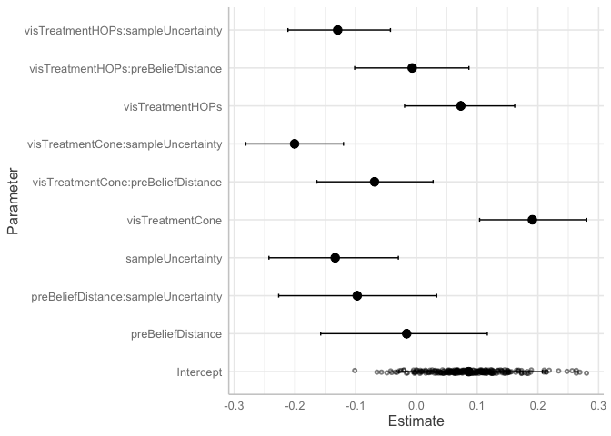<!-- -->

Better – but we’re still overfitting. It appears to be bimodal, maybe
even “tri”-modal. We suspect this is due to the IV’s, namely Belief
Distance’s bimodal features.

### Compare Coefficients

As a final check, let’s compare the coefficients for the normal Bayesian
mixed effects model and the (hurdle) Lognormal Bayesian mixed effects
model.

``` r
coef_bm_df <- coef_bm$data
coef_bm2_df <- coef_bm2$data
coef_bm_df$Parameter[coef_bm_df$Parameter=="Intercept"] <- "(Intercept)"
coef_bm2_df$Parameter[coef_bm2_df$Parameter=="Intercept"] <- "(Intercept)"

joined_models <- inner_join(coef_bm_df, coef_bm2_df, by = "Parameter")
```

Let’s examine the coefficient differences with the different
likelihoods.

``` r
un_coef <- joined_models %>%
  rename(Normal_Estimate = Estimate.x, Lognormal_Estimate = Estimate.y) %>%
  select(Parameter, Normal_Estimate, Lognormal_Estimate) 

un_error <- joined_models %>%
  rename(Normal_low = `2.5%ile.x`, Normal_high = `97.5%ile.x`,Lognormal_low = `2.5%ile.y`, Lognormal_high = `97.5%ile.y`) %>%
  select(Parameter, Normal_low, Normal_high, Lognormal_low, Lognormal_high) 

var_order <- c("(Intercept)","visTreatmentCone","visTreatmentHOPs","preBeliefDistance","sampleUncertainty","visTreatmentCone:preBeliefDistance","visTreatmentHOPs:preBeliefDistance","visTreatmentCone:sampleUncertainty","visTreatmentHOPs:sampleUncertainty","preBeliefDistance:sampleUncertainty")

inner_join(un_coef,un_error,by="Parameter") %>%
  tidyr::pivot_longer(-Parameter) %>%
  tidyr::separate(name, c("Model","Estimate"), sep = "_") %>%
  tidyr::pivot_wider(names_from = c("Estimate")) %>%
  mutate(Parameter = factor(Parameter, levels = rev(var_order))) %>%
  mutate(Model = factor(Model, levels = c("Normal", "Lognormal"))) %>%
  ggplot(aes(x = Parameter, color = Model)) +
  geom_hline(yintercept = 0, alpha = 0.4) +
  geom_point(aes(y = Estimate),  position=position_dodge(.9)) +
  geom_errorbar(aes(ymin = low, ymax = high),  position=position_dodge(.9)) +
  theme(legend.position = c(0.2,0.2),) +
  labs(title = "Abs Belief Difference", subtitle = "Study 3: Vary by Response Distribution") +
  scale_color_manual(values = c("Lognormal" = "red",
                                "Normal"="black")) +  
  coord_flip()
```

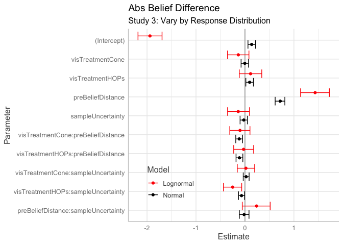<!-- -->

We see the same for the coefficients standard errors:

``` r
joined_models %>%
  rename(Normal_Error = Est.Error.x, Lognormal_Error = Est.Error.y) %>%
  select(Parameter, Normal_Error, Lognormal_Error) %>%
  mutate(Diff_Error = round(Normal_Error - Lognormal_Error,3)) %>%
  knitr::kable()
```

| Parameter                           | Normal\_Error | Lognormal\_Error | Diff\_Error |
|:------------------------------------|--------------:|-----------------:|------------:|
| (Intercept)                         |     0.0402823 |        0.1244492 |      -0.084 |
| preBeliefDistance                   |     0.0510357 |        0.1496734 |      -0.099 |
| preBeliefDistance:sampleUncertainty |     0.0504522 |        0.1435629 |      -0.093 |
| sampleUncertainty                   |     0.0385527 |        0.1156618 |      -0.077 |
| visTreatmentCone                    |     0.0391009 |        0.1124205 |      -0.073 |
| visTreatmentCone:preBeliefDistance  |     0.0352947 |        0.1046472 |      -0.069 |
| visTreatmentCone:sampleUncertainty  |     0.0309645 |        0.0909648 |      -0.060 |
| visTreatmentHOPs                    |     0.0399006 |        0.1183132 |      -0.078 |
| visTreatmentHOPs:preBeliefDistance  |     0.0358284 |        0.1048520 |      -0.069 |
| visTreatmentHOPs:sampleUncertainty  |     0.0317713 |        0.0945104 |      -0.063 |

## 5b. Uncertainty Difference

### Bayesian Mixed Effects

Let’s now examine uncertainty difference (`diffUncertainty`). We’ll use
the same functional form as model `m`.

``` r
bm_u <- brms::brm(diffUncertainty ~ visTreatment * preBeliefDistance + visTreatment * sampleUncertainty +  sampleUncertainty * preBeliefDistance + (1|usertoken) + (1|vars), data = df)

save(bm_u, file = "../models/fit_bm_u.rda")
```

``` r
load("../models/fit_bm_u.rda")
```

First let’s look at metadata around the model.

``` r
coef_bm_u <- coefplot(bm_u)
coef_bm_u
```

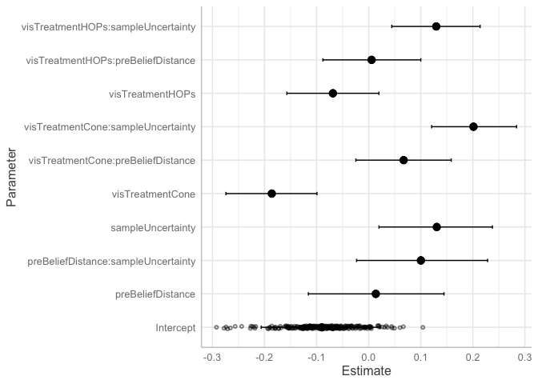<!-- -->

``` r
coef_mu_df <- b$data %>% rename(Parameter = term) %>% mutate(Parameter = as.character(Parameter))

coef_bm_u <- coefplot(bm_u)

coef_bm_u_df <- coef_bm_u$data
coef_bm_u_df$Parameter[coef_bm_u_df$Parameter=="Intercept"] <- "(Intercept)"

joined_models <- inner_join(coef_bm_u_df, coef_mu_df, by = "Parameter")
```

Notice that the coefficients are very similar to Frequentist:

``` r
joined_models %>%
  rename(Bayesian_Estimate = Estimate, Freq_Estimate = estimate) %>%
  select(Parameter, Bayesian_Estimate, Freq_Estimate) %>%
  mutate(abs_diff = round(abs(Bayesian_Estimate - Freq_Estimate),3)) %>%
  knitr::kable()
```

| Parameter                           | Bayesian\_Estimate | Freq\_Estimate | abs\_diff |
|:------------------------------------|-------------------:|---------------:|----------:|
| (Intercept)                         |         -0.0897642 |     -0.0875698 |     0.002 |
| preBeliefDistance                   |          0.0136771 |      0.0120174 |     0.002 |
| preBeliefDistance:sampleUncertainty |          0.1002567 |      0.1013096 |     0.001 |
| sampleUncertainty                   |          0.1306587 |      0.1285109 |     0.002 |
| visTreatmentCone                    |         -0.1860391 |     -0.1863117 |     0.000 |
| visTreatmentCone:preBeliefDistance  |          0.0671158 |      0.0676643 |     0.001 |
| visTreatmentCone:sampleUncertainty  |          0.2011720 |      0.2007491 |     0.000 |
| visTreatmentHOPs                    |         -0.0687158 |     -0.0686954 |     0.000 |
| visTreatmentHOPs:preBeliefDistance  |          0.0055863 |      0.0055774 |     0.000 |
| visTreatmentHOPs:sampleUncertainty  |          0.1297304 |      0.1298018 |     0.000 |

We see the same for the coefficients standard errors (though they mean
slightly different things):

``` r
joined_models %>%
  rename(Bayesian_Error = Est.Error, Freq_Error = std.error) %>%
  select(Parameter, Bayesian_Error, Freq_Error) %>%
  mutate(abs_diff_error = round(abs(Bayesian_Error - Freq_Error),3)) %>%
  knitr::kable()
```

| Parameter                           | Bayesian\_Error | Freq\_Error | abs\_diff\_error |
|:------------------------------------|----------------:|------------:|-----------------:|
| (Intercept)                         |       0.0581389 |   0.0564353 |            0.002 |
| preBeliefDistance                   |       0.0668178 |   0.0673025 |            0.000 |
| preBeliefDistance:sampleUncertainty |       0.0640437 |   0.0650201 |            0.001 |
| sampleUncertainty                   |       0.0548151 |   0.0537443 |            0.001 |
| visTreatmentCone                    |       0.0445588 |   0.0447271 |            0.000 |
| visTreatmentCone:preBeliefDistance  |       0.0474350 |   0.0475906 |            0.000 |
| visTreatmentCone:sampleUncertainty  |       0.0420932 |   0.0419628 |            0.000 |
| visTreatmentHOPs                    |       0.0450824 |   0.0453695 |            0.000 |
| visTreatmentHOPs:preBeliefDistance  |       0.0481859 |   0.0479265 |            0.000 |
| visTreatmentHOPs:sampleUncertainty  |       0.0427990 |   0.0430000 |            0.000 |

### Model convergence / posterior predictive check

The convergence stats also look good - Rhat’s are at 1 and we have
“fuzzy caterpillars”.

``` r
plot(bm_u)
```

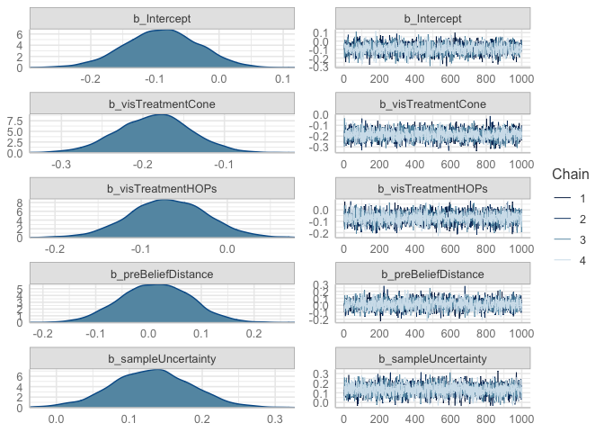<!-- -->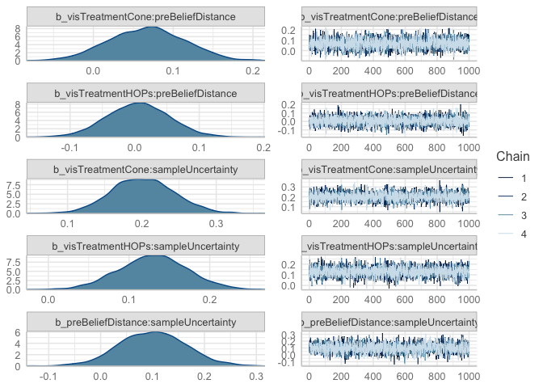<!-- -->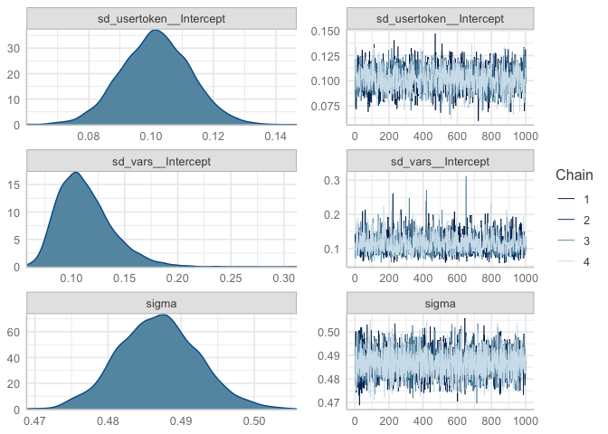<!-- -->

But remember - convergence doesn’t mean great fit. Let’s evaluate
overfitting with Posterior Predictive Checks. We’ll do 10 draws and
compare to actual.

``` r
pp_check(bm_u)
```

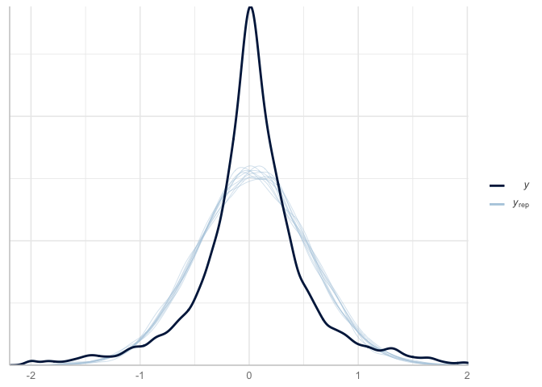<!-- -->

There looks like some misspecification but not terrible (i.e., both
symmetric distributions). Let’s try a t-distribution instead.

### Modify response (likelihood) to t-distribution

Let’s try instead a student t distribution

``` r
bm2_u <- brms::brm(diffUncertainty ~ visTreatment * preBeliefDistance + visTreatment * sampleUncertainty +  sampleUncertainty * preBeliefDistance + (1|usertoken) + (1|vars), data = df, family = student(link = "identity", link_sigma = "log", link_nu = "logm1"))

save(bm2_u, file = "../models/fit_bm2_u.rda")
```

``` r
load("../models/fit_bm2_u.rda")
```

### What are model priors?

``` r
bm2_u$prior
```

    ##                 prior     class                                coef     group
    ##                (flat)         b                                              
    ##                (flat)         b                   preBeliefDistance          
    ##                (flat)         b preBeliefDistance:sampleUncertainty          
    ##                (flat)         b                   sampleUncertainty          
    ##                (flat)         b                    visTreatmentCone          
    ##                (flat)         b  visTreatmentCone:preBeliefDistance          
    ##                (flat)         b  visTreatmentCone:sampleUncertainty          
    ##                (flat)         b                    visTreatmentHOPs          
    ##                (flat)         b  visTreatmentHOPs:preBeliefDistance          
    ##                (flat)         b  visTreatmentHOPs:sampleUncertainty          
    ##  student_t(3, 0, 2.5) Intercept                                              
    ##         gamma(2, 0.1)        nu                                              
    ##  student_t(3, 0, 2.5)        sd                                              
    ##  student_t(3, 0, 2.5)        sd                                     usertoken
    ##  student_t(3, 0, 2.5)        sd                           Intercept usertoken
    ##  student_t(3, 0, 2.5)        sd                                          vars
    ##  student_t(3, 0, 2.5)        sd                           Intercept      vars
    ##  student_t(3, 0, 2.5)     sigma                                              
    ##  resp dpar nlpar bound       source
    ##                             default
    ##                        (vectorized)
    ##                        (vectorized)
    ##                        (vectorized)
    ##                        (vectorized)
    ##                        (vectorized)
    ##                        (vectorized)
    ##                        (vectorized)
    ##                        (vectorized)
    ##                        (vectorized)
    ##                             default
    ##                             default
    ##                             default
    ##                        (vectorized)
    ##                        (vectorized)
    ##                        (vectorized)
    ##                        (vectorized)
    ##                             default

### What are the coefficients?

``` r
coef_bm2_u <- coefplot(bm2_u)
coef_bm2_u
```

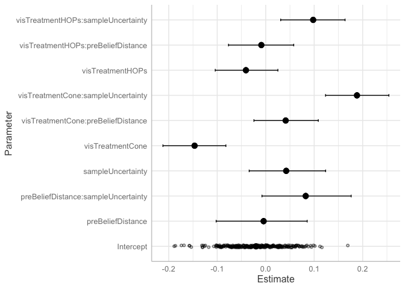<!-- -->

### Model Comparison

First, let’s use leave-one-out (loo) cross-validation. It will also
provide estimate to determine point leverage (aka outliers).

``` r
looNormal_u <- loo(bm_u, save_psis = TRUE)
print(looNormal_u)
```

    ## 
    ## Computed from 4000 by 4267 log-likelihood matrix
    ## 
    ##          Estimate    SE
    ## elpd_loo  -3051.5  68.4
    ## p_loo       133.3   4.3
    ## looic      6103.1 136.9
    ## ------
    ## Monte Carlo SE of elpd_loo is 0.2.
    ## 
    ## All Pareto k estimates are good (k < 0.5).
    ## See help('pareto-k-diagnostic') for details.

``` r
looT <- loo(bm2_u, save_psis = TRUE)
print(looT)
```

    ## 
    ## Computed from 4000 by 4267 log-likelihood matrix
    ## 
    ##          Estimate    SE
    ## elpd_loo  -2690.4  72.1
    ## p_loo       153.9   1.8
    ## looic      5380.9 144.2
    ## ------
    ## Monte Carlo SE of elpd_loo is 0.2.
    ## 
    ## All Pareto k estimates are good (k < 0.5).
    ## See help('pareto-k-diagnostic') for details.

When comparing two fitted models, we can estimate the difference in
their expected predictive accuracy by the difference in elpd-dloo or
elpd-dwaic.

``` r
loo_compare(looNormal_u, looT)
```

    ##       elpd_diff se_diff
    ## bm2_u    0.0       0.0 
    ## bm_u  -361.1      31.0

WAIC criterion

``` r
waicNormal_u = waic(bm_u)
waicT = waic(bm2_u)
loo_compare(waicNormal_u, waicT)
```

    ##       elpd_diff se_diff
    ## bm2_u    0.0       0.0 
    ## bm_u  -361.0      31.0

As a last step, let’s do a posterior predictive check:

``` r
pp_check(bm2_u) + xlim(-3,3)
```

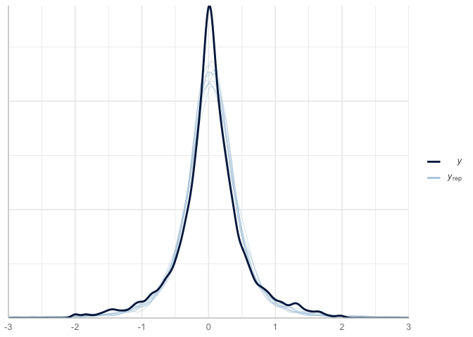<!-- -->

### Compare Coefficients

As a final check, let’s compare the coefficients for the normal Bayesian
mixed effects model and the t-distribution Bayesian mixed effects model.

``` r
coef_bm_u_df <- coef_bm_u$data
coef_bm2_u_df <- coef_bm2_u$data
coef_bm_u_df$Parameter[coef_bm_u_df$Parameter=="Intercept"] <- "(Intercept)"
coef_bm2_u_df$Parameter[coef_bm2_u_df$Parameter=="Intercept"] <- "(Intercept)"

joined_models <- inner_join(coef_bm_u_df, coef_bm2_u_df, by = "Parameter")
```

``` r
joined_models %>%
  rename(Normal_Estimate = Estimate.x, StudentT_Estimate = Estimate.y) %>%
  select(Parameter, Normal_Estimate, StudentT_Estimate) %>%
  mutate(Difference = round(Normal_Estimate - StudentT_Estimate,3)) %>%
  knitr::kable()
```

| Parameter                           | Normal\_Estimate | StudentT\_Estimate | Difference |
|:------------------------------------|-----------------:|-------------------:|-----------:|
| (Intercept)                         |       -0.0897642 |         -0.0200240 |     -0.070 |
| preBeliefDistance                   |        0.0136771 |         -0.0042911 |      0.018 |
| preBeliefDistance:sampleUncertainty |        0.1002567 |          0.0825076 |      0.018 |
| sampleUncertainty                   |        0.1306587 |          0.0422592 |      0.088 |
| visTreatmentCone                    |       -0.1860391 |         -0.1466749 |     -0.039 |
| visTreatmentCone:preBeliefDistance  |        0.0671158 |          0.0411721 |      0.026 |
| visTreatmentCone:sampleUncertainty  |        0.2011720 |          0.1882463 |      0.013 |
| visTreatmentHOPs                    |       -0.0687158 |         -0.0407700 |     -0.028 |
| visTreatmentHOPs:preBeliefDistance  |        0.0055863 |         -0.0090162 |      0.015 |
| visTreatmentHOPs:sampleUncertainty  |        0.1297304 |          0.0978760 |      0.032 |

We see the same for the coefficients standard errors:

``` r
joined_models %>%
  rename(Normal_Error = Est.Error.x, StudentT_Error = Est.Error.y) %>%
  select(Parameter, Normal_Error, StudentT_Error) %>%
  mutate(Diff_Error = round(Normal_Error - StudentT_Error,3)) %>%
  knitr::kable()
```

| Parameter                           | Normal\_Error | StudentT\_Error | Diff\_Error |
|:------------------------------------|--------------:|----------------:|------------:|
| (Intercept)                         |     0.0581389 |       0.0394573 |       0.019 |
| preBeliefDistance                   |     0.0668178 |       0.0482088 |       0.019 |
| preBeliefDistance:sampleUncertainty |     0.0640437 |       0.0474667 |       0.017 |
| sampleUncertainty                   |     0.0548151 |       0.0398163 |       0.015 |
| visTreatmentCone                    |     0.0445588 |       0.0327885 |       0.012 |
| visTreatmentCone:preBeliefDistance  |     0.0474350 |       0.0339575 |       0.013 |
| visTreatmentCone:sampleUncertainty  |     0.0420932 |       0.0329402 |       0.009 |
| visTreatmentHOPs                    |     0.0450824 |       0.0334555 |       0.012 |
| visTreatmentHOPs:preBeliefDistance  |     0.0481859 |       0.0348774 |       0.013 |
| visTreatmentHOPs:sampleUncertainty  |     0.0427990 |       0.0339606 |       0.009 |

``` r
un_coef <- joined_models %>%
  rename(Normal_Estimate = Estimate.x, StudentT_Estimate = Estimate.y) %>%
  select(Parameter, Normal_Estimate, StudentT_Estimate) 

un_error <- joined_models %>%
  rename(Normal_low = `2.5%ile.x`, Normal_high = `97.5%ile.x`,StudentT_low = `2.5%ile.y`, StudentT_high = `97.5%ile.y`) %>%
  select(Parameter, Normal_low, Normal_high, StudentT_low, StudentT_high) 

var_order <- c("(Intercept)","visTreatmentCone","visTreatmentHOPs","preBeliefDistance","sampleUncertainty","visTreatmentCone:preBeliefDistance","visTreatmentHOPs:preBeliefDistance","visTreatmentCone:sampleUncertainty","visTreatmentHOPs:sampleUncertainty","preBeliefDistance:sampleUncertainty")

inner_join(un_coef,un_error,by="Parameter") %>%
  tidyr::pivot_longer(-Parameter) %>%
  tidyr::separate(name, c("Model","Estimate"), sep = "_") %>%
  tidyr::pivot_wider(names_from = c("Estimate")) %>%
  mutate(Parameter = factor(Parameter, levels = rev(var_order))) %>%
    mutate(Model = factor(Model, levels = c("Normal", "StudentT"))) %>%
  ggplot(aes(x = Parameter, color = Model)) +
  geom_hline(yintercept = 0, alpha = 0.4) +
  geom_point(aes(y = Estimate),  position=position_dodge(.9)) +
  geom_errorbar(aes(ymin = low, ymax = high),  position=position_dodge(.9)) +
  theme(legend.position = c(0.2,0.2),) +
  labs(title = "Uncertainty Difference", subtitle = "Study 3: Vary by Response Distribution") +
  scale_color_manual(values = c("StudentT" = "red",
                                "Normal"="black")) + 
  coord_flip()
```

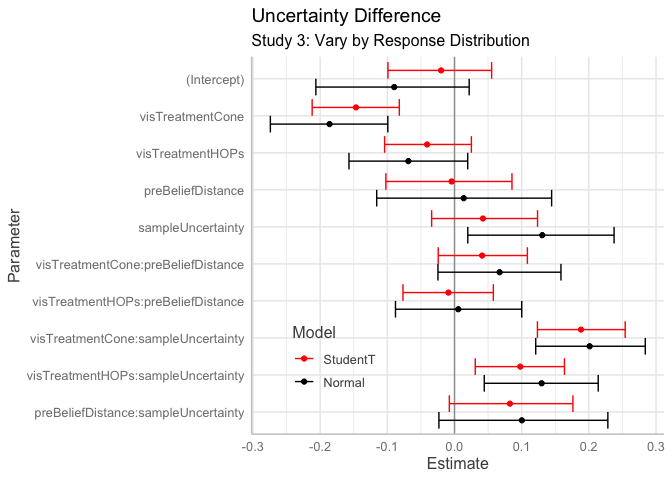<!-- -->
