Study 3: Mixed Effects Modeling
================

## 1. Import Packages

``` r
library(ggplot2)
library(statsr)
library(lme4)
library(sjPlot)
library(dplyr)
library(brmstools)
theme_set(theme_sjplot())
```

## 2. Load Data

``` r
df <- read.csv(file="../data/vis2020/data_exclude_mturk2020-04-26.csv")

# refactor and categorize
df$visGroup <- factor(df$visGroup, c("line","band","hop"))
levels(df$visGroup ) <- c("Line","Cone","HOPs")
df$nDataShown <- factor(df$nDataShown)

df <- rename(df, 
             sampleUncertainty = uncertaintyShown,
             visTreatment = visGroup)

df <- within(df, visTreatment <- relevel(visTreatment, ref = 1))
```

## 3. Exploratory Graphs

``` r
g1 <- df %>%
  rename(Congruency = congruency) %>%
  ggplot(aes(x=preBeliefDistance,fill=Congruency)) + 
  geom_density(alpha=0.5) +
  annotate("text", x = 1.4, y = 2.8, label = "Incongruent", size = 2.5) +
  annotate("text", x = 0.75, y = 3.7, label = "Congruent", size = 2.5) +
  theme(legend.position = "none") + 
  labs(x = " ", y = " ", subtitle = "Pre-Belief Distance") 

g2 <- df %>%
  ggplot(aes(x=sampleUncertainty,fill=nDataShown)) + 
  geom_density(alpha=0.5) +
  annotate("text", x = 1.3, y = 2, label = "Data Shown\n(n = 10)", size = 2.5) +
  annotate("text", x = 0.75, y = 3.7, label = "Data Shown\n(n = 100)", size = 2.5) +
  theme(legend.position = "none") +
  labs(x = " ", y = " ", subtitle = "Sample Uncertainty")

cowplot::plot_grid(g1, g2,
                   label_x = -0.2,
                   ncol = 2)
```

<!-- -->

## 4. Frequentist Mixed Effects Modeling (`lme4`)

``` r
# Absolute Belief Distance
m = lmer(diffBeliefAbs ~ visTreatment * preBeliefDistance + visTreatment * sampleUncertainty +  sampleUncertainty * preBeliefDistance  +  (1|usertoken) + (1|vars),df)
# Uncertainty Difference
m1 = lmer(diffUncertainty ~ visTreatment * preBeliefDistance + visTreatment * sampleUncertainty +  sampleUncertainty * preBeliefDistance  + (1|usertoken) + (1|vars),df)
```

``` r
a <- plot_model(m,show.values = TRUE, vline.color = "grey", value.offset = .4, value.size = 3, type="est", show.intercept = TRUE ) +
  scale_y_continuous(breaks=seq(-.75,0.75,.25)) +
  theme(axis.text.y = element_text(size = 8),
        plot.subtitle=element_text(size=11), plot.title = element_text(size = 1)) +
  labs(subtitle = "Absolute Belief Difference", title = "") +
  ylim(-0.25, 0.9)

b <- plot_model(m1, vline.color = "grey",show.values = TRUE, value.offset = .4, value.size = 3, show.intercept = TRUE) +
  ylim(-.3,.3) +
  theme(axis.text.y=element_blank(),
        plot.subtitle=element_text(size=11), plot.title = element_text(size = 1)) +
  labs(subtitle = "Uncertainty Difference", title = "")

# final plots
library(cowplot)

plot_grid(a,
  b,
  label_x = -0.2,
  ncol = 2,
  rel_widths = c(4.6, 2.4)) 
```

<!-- -->

## 5a. Absolute Belief Difference

### Bayesian Mixed Effects

For the Vis 2020 paper, we did not run a Bayesian mixed effects model.

Let’s examine the first regression to estimate the effect on the
absolute belief change (`diffBeliefAbs`). We’ll use the same functional
form as model `m`.

First let’s look at metadata around the model.

``` r
coefplot(bm)
```

<!-- -->

``` r
coef_m_df <- a$data %>% rename(Parameter = term) %>% mutate(Parameter = as.character(Parameter))

coef_bm <- coefplot(bm)

coef_bm_df <- coef_bm$data
coef_bm_df$Parameter[coef_bm_df$Parameter=="Intercept"] <- "(Intercept)"

joined_models <- inner_join(coef_bm_df, coef_m_df, by = "Parameter")
```

Notice that the coefficients are very similar to Frequentist:

``` r
joined_models %>%
  rename(Bayesian_Estimate = Estimate, Freq_Estimate = estimate) %>%
  select(Bayesian_Estimate, Freq_Estimate) %>%
  mutate(abs_diff = round(abs(Bayesian_Estimate - Freq_Estimate),3)) %>%
  knitr::kable()
```

| Bayesian\_Estimate | Freq\_Estimate | abs\_diff |
|-------------------:|---------------:|----------:|
|          0.1388010 |      0.1358401 |     0.003 |
|          0.7178997 |      0.7231434 |     0.005 |
|         -0.0156738 |     -0.0188768 |     0.003 |
|         -0.0260823 |     -0.0249925 |     0.001 |
|         -0.0035645 |     -0.0039647 |     0.000 |
|         -0.1170579 |     -0.1162205 |     0.001 |
|          0.0243800 |      0.0247423 |     0.000 |
|          0.0978748 |      0.0977617 |     0.000 |
|         -0.1126694 |     -0.1122588 |     0.000 |
|         -0.0748911 |     -0.0744954 |     0.000 |

We see the same for the coefficients standard errors (though they mean
slightly different things):

``` r
joined_models %>%
  rename(Bayesian_Error = Est.Error, Freq_Error = std.error) %>%
  select(Bayesian_Error, Freq_Error) %>%
  mutate(abs_diff_error = round(abs(Bayesian_Error - Freq_Error),3)) %>%
  knitr::kable()
```

| Bayesian\_Error | Freq\_Error | abs\_diff\_error |
|----------------:|------------:|-----------------:|
|       0.0400840 |   0.0366095 |            0.003 |
|       0.0506850 |   0.0421795 |            0.009 |
|       0.0503724 |   0.0441377 |            0.006 |
|       0.0394864 |   0.0366809 |            0.003 |
|       0.0391714 |   0.0393106 |            0.000 |
|       0.0351493 |   0.0356856 |            0.001 |
|       0.0307691 |   0.0314600 |            0.001 |
|       0.0393568 |   0.0400026 |            0.001 |
|       0.0352750 |   0.0359997 |            0.001 |
|       0.0324932 |   0.0323808 |            0.000 |

### Model convergence / posterior predictive check

The convergence stats also look good - Rhat’s are at 1 and we have
“fuzzy catepillars”.

``` r
plot(bm)
```

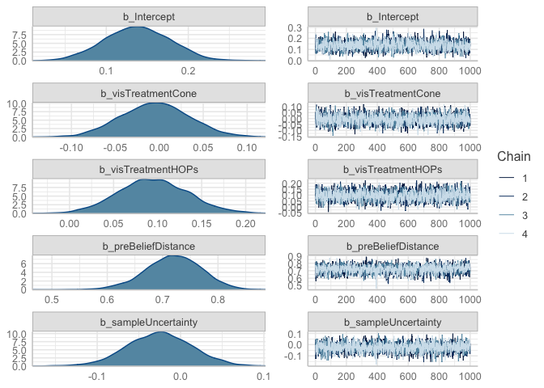<!-- -->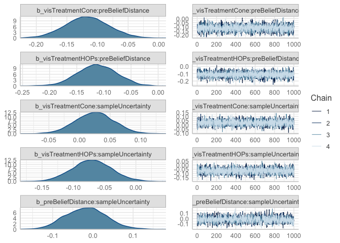<!-- -->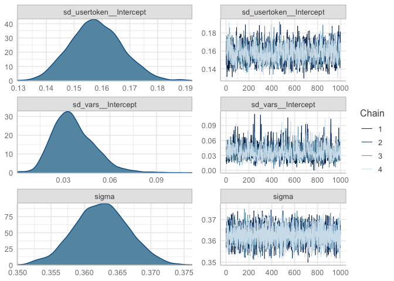<!-- -->

But remember - convergence doesn’t mean great fit. Let’s evaluate
overfitting with Posterior Predictive Checks. We’ll do 10 draws and
compare to actual.

``` r
pp_check(bm)
```

<!-- -->

There looks like some misspecification.

### Modify response (likelihood) to lognormal

Let’s try instead a lognormal likelihood.

### What are model priors?

``` r
bm2$prior
```

    ##                  prior     class                                coef     group
    ##                 (flat)         b                                              
    ##                 (flat)         b                   preBeliefDistance          
    ##                 (flat)         b preBeliefDistance:sampleUncertainty          
    ##                 (flat)         b                   sampleUncertainty          
    ##                 (flat)         b                    visTreatmentCone          
    ##                 (flat)         b  visTreatmentCone:preBeliefDistance          
    ##                 (flat)         b  visTreatmentCone:sampleUncertainty          
    ##                 (flat)         b                    visTreatmentHOPs          
    ##                 (flat)         b  visTreatmentHOPs:preBeliefDistance          
    ##                 (flat)         b  visTreatmentHOPs:sampleUncertainty          
    ##  student_t(3, -1, 2.5) Intercept                                              
    ##   student_t(3, 0, 2.5)        sd                                              
    ##   student_t(3, 0, 2.5)        sd                                     usertoken
    ##   student_t(3, 0, 2.5)        sd                           Intercept usertoken
    ##   student_t(3, 0, 2.5)        sd                                          vars
    ##   student_t(3, 0, 2.5)        sd                           Intercept      vars
    ##   student_t(3, 0, 2.5)     sigma                                              
    ##  resp dpar nlpar bound       source
    ##                             default
    ##                        (vectorized)
    ##                        (vectorized)
    ##                        (vectorized)
    ##                        (vectorized)
    ##                        (vectorized)
    ##                        (vectorized)
    ##                        (vectorized)
    ##                        (vectorized)
    ##                        (vectorized)
    ##                             default
    ##                             default
    ##                        (vectorized)
    ##                        (vectorized)
    ##                        (vectorized)
    ##                        (vectorized)
    ##                             default

``` r
coefplot(bm2)
```

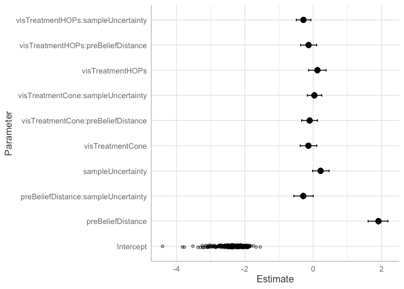<!-- -->

### Model Comparison

First, let’s use leave-one-out (loo) cross-validation. It will also
provide estimate to determine point leverage (aka outliers).

``` r
looNormal <- loo(bm, save_psis = TRUE)
print(looNormal)
```

    ## 
    ## Computed from 4000 by 4228 log-likelihood matrix
    ## 
    ##          Estimate    SE
    ## elpd_loo  -1822.4  75.8
    ## p_loo       216.1   7.6
    ## looic      3644.9 151.7
    ## ------
    ## Monte Carlo SE of elpd_loo is 0.2.
    ## 
    ## All Pareto k estimates are good (k < 0.5).
    ## See help('pareto-k-diagnostic') for details.

``` r
looNormal <- loo(bm, save_psis = TRUE)
print(looNormal)
```

    ## 
    ## Computed from 4000 by 4228 log-likelihood matrix
    ## 
    ##          Estimate    SE
    ## elpd_loo  -1822.4  75.8
    ## p_loo       216.1   7.6
    ## looic      3644.9 151.7
    ## ------
    ## Monte Carlo SE of elpd_loo is 0.2.
    ## 
    ## All Pareto k estimates are good (k < 0.5).
    ## See help('pareto-k-diagnostic') for details.

``` r
looLog <- loo(bm2, save_psis = TRUE)
print(looLog)
```

    ## 
    ## Computed from 4000 by 4228 log-likelihood matrix
    ## 
    ##          Estimate    SE
    ## elpd_loo  -1459.2  80.8
    ## p_loo       202.7   7.1
    ## looic      2918.5 161.7
    ## ------
    ## Monte Carlo SE of elpd_loo is 0.2.
    ## 
    ## All Pareto k estimates are good (k < 0.5).
    ## See help('pareto-k-diagnostic') for details.

When comparing two fitted models, we can estimate the difference in
their expected predictive accuracy by the difference in elpd-dloo or
elpd-dwaic.

``` r
loo_compare(looNormal, looLog)
```

    ##     elpd_diff se_diff
    ## bm2    0.0       0.0 
    ## bm  -363.2      78.1

WAIC criterion

``` r
waicNormal = waic(bm)
waicLog = waic(bm2)
loo_compare(waicNormal, waicLog)
```

    ##     elpd_diff se_diff
    ## bm2    0.0       0.0 
    ## bm  -363.0      78.1

As a last step, let’s do a posterior predictive check:

``` r
pp_check(bm2) + xlim(-1,3)
```

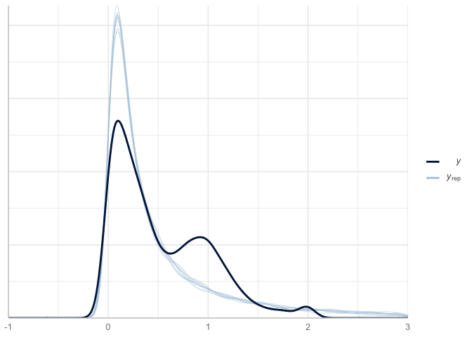<!-- -->

Better – but we’re still overfitting. It appears to be bimodal.

This may be a solution to do a Bayesian mixture for lognormal. [Chapter
20 of “An Introduction to Bayesian Data Analysis for Cognitive
Science”](https://vasishth.github.io/bayescogsci/book/a-mixture-model-of-the-speed-accuracy-trade-off-the-fast-guess-model-account.html)

## 5b. Uncertainty Difference

### Bayesian Mixed Effects

Let’s now examine uncertainty difference (`diffUncertainty`). We’ll use
the same functional form as model `m`.

First let’s look at metadata around the model.

``` r
coefplot(bm_u)
```

<!-- -->

``` r
coef_mu_df <- b$data %>% rename(Parameter = term) %>% mutate(Parameter = as.character(Parameter))

coef_bm_u <- coefplot(bm_u)

coef_bm_u_df <- coef_bm_u$data
coef_bm_u_df$Parameter[coef_bm_u_df$Parameter=="Intercept"] <- "(Intercept)"

joined_models <- inner_join(coef_bm_u_df, coef_mu_df, by = "Parameter")
```

Notice that the coefficients are very similar to Frequentist:

``` r
joined_models %>%
  rename(Bayesian_Estimate = Estimate, Freq_Estimate = estimate) %>%
  select(Bayesian_Estimate, Freq_Estimate) %>%
  mutate(abs_diff = round(abs(Bayesian_Estimate - Freq_Estimate),3)) %>%
  knitr::kable()
```

| Bayesian\_Estimate | Freq\_Estimate | abs\_diff |
|-------------------:|---------------:|----------:|
|          0.0862448 |      0.0861421 |     0.000 |
|         -0.0160765 |     -0.0155808 |     0.000 |
|         -0.0975233 |     -0.0968443 |     0.001 |
|         -0.1337295 |     -0.1315453 |     0.002 |
|          0.1908725 |      0.1902755 |     0.001 |
|         -0.0689556 |     -0.0677322 |     0.001 |
|         -0.2006140 |     -0.2010290 |     0.000 |
|          0.0730383 |      0.0732108 |     0.000 |
|         -0.0069977 |     -0.0068852 |     0.000 |
|         -0.1297138 |     -0.1297598 |     0.000 |

We see the same for the coefficients standard errors (though they mean
slightly different things):

``` r
joined_models %>%
  rename(Bayesian_Error = Est.Error, Freq_Error = std.error) %>%
  select(Bayesian_Error, Freq_Error) %>%
  mutate(abs_diff_error = round(abs(Bayesian_Error - Freq_Error),3)) %>%
  knitr::kable()
```

| Bayesian\_Error | Freq\_Error | abs\_diff\_error |
|----------------:|------------:|-----------------:|
|       0.0609153 |   0.0567985 |            0.004 |
|       0.0703527 |   0.0677670 |            0.003 |
|       0.0658322 |   0.0654230 |            0.000 |
|       0.0545973 |   0.0541252 |            0.000 |
|       0.0452921 |   0.0448679 |            0.000 |
|       0.0486745 |   0.0478637 |            0.001 |
|       0.0412439 |   0.0421794 |            0.001 |
|       0.0457825 |   0.0456403 |            0.000 |
|       0.0483745 |   0.0483337 |            0.000 |
|       0.0431626 |   0.0434167 |            0.000 |

### Model convergence / posterior predictive check

The convergence stats also look good - Rhat’s are at 1 and we have
“fuzzy catepillars”.

``` r
plot(bm_u)
```

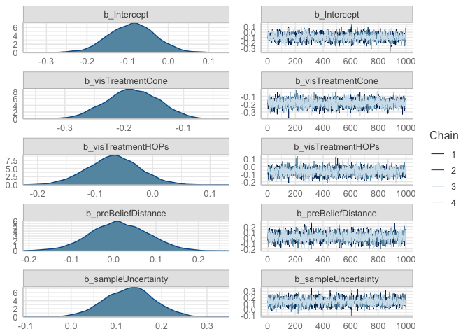<!-- -->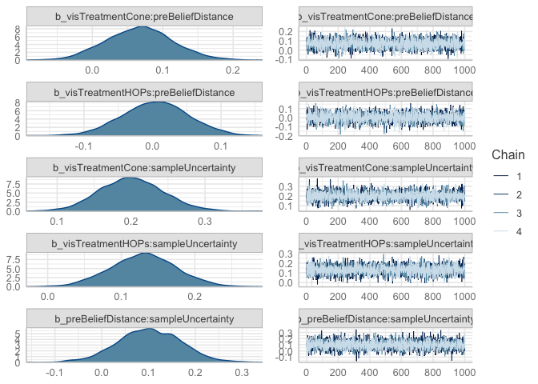<!-- -->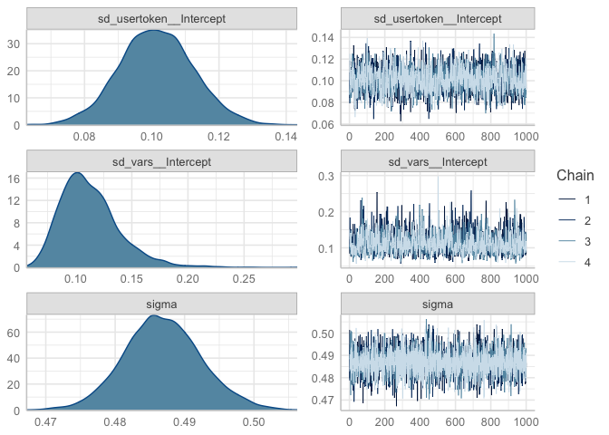<!-- -->

But remember - convergence doesn’t mean great fit. Let’s evaluate
overfitting with Posterior Predictive Checks. We’ll do 10 draws and
compare to actual.

``` r
pp_check(bm_u)
```

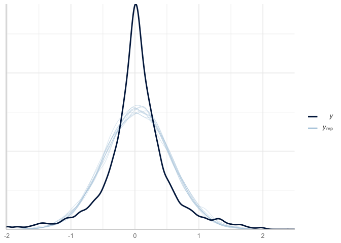<!-- -->

There looks like some misspecification but at least we’re

### Modify response (likelihood) to lognormal

Let’s try instead a student t distribution

### What are model priors?

``` r
bm2_u$prior
```

    ##                 prior     class                                coef     group
    ##                (flat)         b                                              
    ##                (flat)         b                   preBeliefDistance          
    ##                (flat)         b preBeliefDistance:sampleUncertainty          
    ##                (flat)         b                   sampleUncertainty          
    ##                (flat)         b                    visTreatmentCone          
    ##                (flat)         b  visTreatmentCone:preBeliefDistance          
    ##                (flat)         b  visTreatmentCone:sampleUncertainty          
    ##                (flat)         b                    visTreatmentHOPs          
    ##                (flat)         b  visTreatmentHOPs:preBeliefDistance          
    ##                (flat)         b  visTreatmentHOPs:sampleUncertainty          
    ##  student_t(3, 0, 2.5) Intercept                                              
    ##         gamma(2, 0.1)        nu                                              
    ##  student_t(3, 0, 2.5)        sd                                              
    ##  student_t(3, 0, 2.5)        sd                                     usertoken
    ##  student_t(3, 0, 2.5)        sd                           Intercept usertoken
    ##  student_t(3, 0, 2.5)        sd                                          vars
    ##  student_t(3, 0, 2.5)        sd                           Intercept      vars
    ##  student_t(3, 0, 2.5)     sigma                                              
    ##  resp dpar nlpar bound       source
    ##                             default
    ##                        (vectorized)
    ##                        (vectorized)
    ##                        (vectorized)
    ##                        (vectorized)
    ##                        (vectorized)
    ##                        (vectorized)
    ##                        (vectorized)
    ##                        (vectorized)
    ##                        (vectorized)
    ##                             default
    ##                             default
    ##                             default
    ##                        (vectorized)
    ##                        (vectorized)
    ##                        (vectorized)
    ##                        (vectorized)
    ##                             default

``` r
coefplot(bm2_u)
```

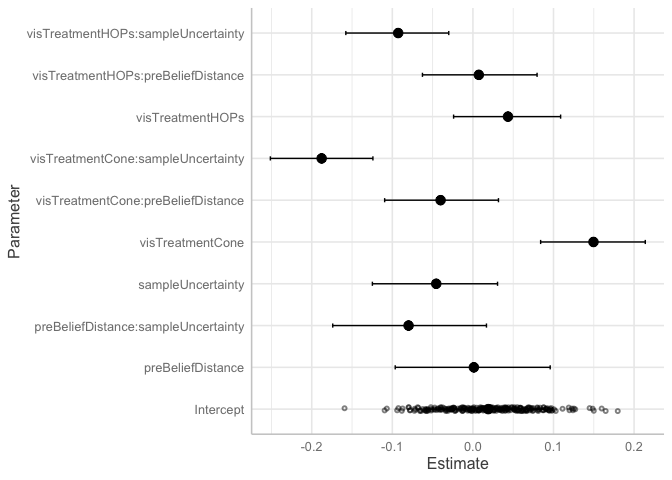<!-- -->

### Model Comparison

First, let’s use leave-one-out (loo) cross-validation. It will also
provide estimate to determine point leverage (aka outliers).

``` r
looNormal_u <- loo(bm_u, save_psis = TRUE)
print(looNormal_u)
```

    ## 
    ## Computed from 4000 by 4235 log-likelihood matrix
    ## 
    ##          Estimate    SE
    ## elpd_loo  -3040.4  68.0
    ## p_loo       130.1   4.2
    ## looic      6080.9 136.1
    ## ------
    ## Monte Carlo SE of elpd_loo is 0.2.
    ## 
    ## All Pareto k estimates are good (k < 0.5).
    ## See help('pareto-k-diagnostic') for details.

``` r
looT <- loo(bm2_u, save_psis = TRUE)
print(looT)
```

    ## 
    ## Computed from 4000 by 4235 log-likelihood matrix
    ## 
    ##          Estimate    SE
    ## elpd_loo  -2685.4  71.7
    ## p_loo       146.4   1.7
    ## looic      5370.8 143.5
    ## ------
    ## Monte Carlo SE of elpd_loo is 0.2.
    ## 
    ## All Pareto k estimates are good (k < 0.5).
    ## See help('pareto-k-diagnostic') for details.

When comparing two fitted models, we can estimate the difference in
their expected predictive accuracy by the difference in elpd-dloo or
elpd-dwaic.

``` r
loo_compare(looNormal_u, looT)
```

    ##       elpd_diff se_diff
    ## bm2_u    0.0       0.0 
    ## bm_u  -355.1      30.7

WAIC criterion

``` r
waicNormal_u = waic(bm_u)
waicT = waic(bm2_u)
loo_compare(waicNormal_u, waicT)
```

    ##       elpd_diff se_diff
    ## bm2_u    0.0       0.0 
    ## bm_u  -354.9      30.7

As a last step, let’s do a posterior predictive check:

``` r
pp_check(bm2_u) + xlim(-3,3)
```

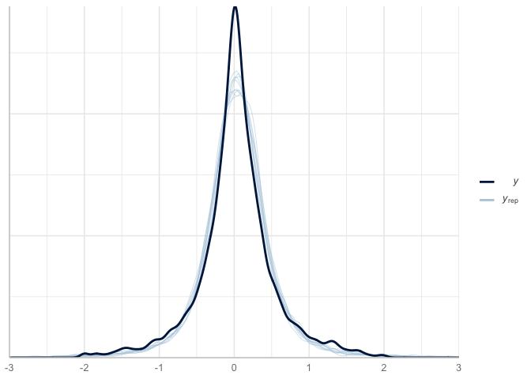<!-- -->
